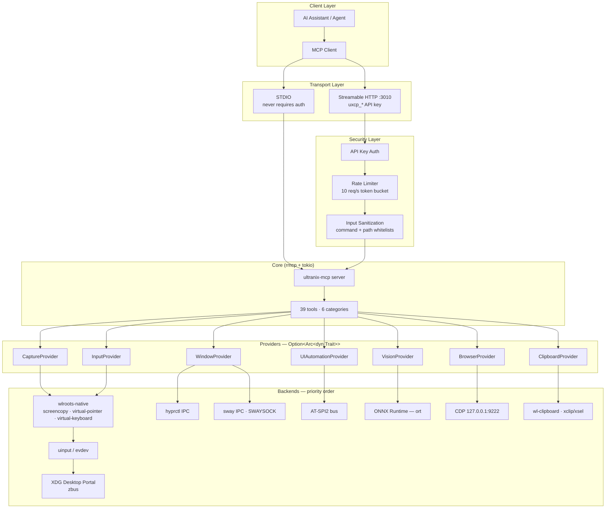

# ultranix-mcp

[](Cargo.toml)
[](LICENSE)
[](https://hyprland.org/)
[](https://www.rust-lang.org/)
[](https://github.com/modelcontextprotocol/rust-sdk)
[](ROADMAP.md)

**ultranix-mcp is the enterprise-grade, secure Linux desktop-automation layer
for AI agents.** It gives Model Context Protocol (MCP) clients — Claude
Desktop, Claude Code, Cursor, Windsurf, and any MCP-enabled assistant — the
ability to see, click, type, and drive a Wayland desktop: mouse, keyboard,
screenshots, OCR, icon finding, window management, and accessibility-tree
inspection.

ultranix-mcp is **Wayland-native by design**: compositor protocols first,
`uinput`/`evdev` second, XDG Desktop Portals last — behind the same
governance-and-trust surface as its siblings (ultramac on macOS, ultrawin on
Windows): audit logging, rate limiting, input sanitization, and
AES-256-GCM-encrypted action history. It is the first Linux desktop MCP to
combine a cross-compositor fallback ladder, a full governance surface, and a
tri-OS sibling contract — organisations can let agents control a Linux
desktop without giving up control themselves.

> **Status:** v1.3.0 implemented. Phases 0–5 of
> [ROADMAP.md](ROADMAP.md) have shipped, plus the v1.1.0 wave (layer-shell
> overlay, X11-native providers, PipeWire portal capture, opt-in Sentry,
> OCR cache, additional metrics), the v1.2.0 breadth wave (clipboard
> tools, plugin tool-macros, `screen_record`, sway/Wayfire/river/KDE/GNOME
> session detection, per-backend cargo features, framed history v2), and
> the v1.3.0 policy wave (runtime access-control policy with per-key
> roles, `--readonly`/`--allow-tools`/`--deny-tools`, per-backend
> invocation metrics, optional HMAC-signed audit lines) — see
> [CHANGELOG.md](CHANGELOG.md) for per-release notes. The verified target
> environment is **CachyOS (Arch) + Hyprland on Wayland**, PipeWire,
> `xdg-desktop-portal-hyprland`, and a live AT-SPI2 bus, on Rust 1.98.1.

---

## 🚀 Features

- **🖱️ Precision Mouse Control** — click, double-click, drag, scroll,
  button-state control, position queries, and smooth path movement via the
  `zwlr_virtual_pointer_v1` protocol. No root, no helper daemons.
- **⌨️ Advanced Keyboard Input** — type text and drive key states through
  `virtual-keyboard-unstable-v1`, with full modifier and keymap handling.
- **📸 Intelligent Vision** — in-process `wlr-screencopy-unstable-v1` capture,
  ONNX Runtime OCR (`ort` crate), and OWL-ViT icon finding. Region
  screenshots, color sampling (`color_at`), and session spatial focus
  (`set_spatial_focus` scopes `screenshot`/`find_text_on_screen`/`find_icon`),
  and real `screen_highlight` overlays via `zwlr_layer_shell_v1`
  (translucent, click-through; `-32010 ProviderUnavailable` on
  compositors/sessions without layer-shell — see
  [docs/TOOLS.md](docs/TOOLS.md)).
- **🪟 Window Management** — list, focus, move, resize, close, and inspect
  windows through Hyprland's `hyprctl` IPC socket (`hyprctl -j` JSON:
  `clients`, `activewindow`, `dispatch`, `workspaces`), sway's own IPC
  protocol on `$SWAYSOCK`, or `wmctrl` on X11 sessions.
- **🔍 UI Inspection** — full accessibility-tree access over AT-SPI2
  (`atspi` crate): UI-tree dumps, focused-element queries, element search,
  and wait-for-element synchronization.
- **📋 Clipboard & Plugins** — `clipboard_get`/`clipboard_set`/
  `clipboard_clear` over `wl-clipboard` (Wayland) or `xclip`/`xsel` (X11),
  writes consent-gated; and declarative plugin tool-macros —
  `~/.ultranix-mcp/plugins/*.json` manifests of catalog-tool steps run via
  `plugin_list`/`plugin_run`/`plugin_reload`, each step re-entering the
  secured dispatch path.
- **🎥 Bounded Screen Recording** — `screen_record` captures a frame every
  `interval_ms` for up to `duration_ms` into a fresh `rec-<ulid>` dir plus
  a `manifest.json` (hard caps: 600 frames, 512 MiB).
- **🛡️ Enterprise Security** — `uxcp_*` API-key auth on HTTP, 10 req/s token
  bucket, input sanitization, command/path whitelists, AES-256-GCM-encrypted
  action history, and JSONL audit logging. See [SECURITY.md](SECURITY.md).

---

## 🏗️ Architecture

ultranix-mcp is a single Rust 2024 binary on the `tokio` runtime, built on
[`rmcp`](https://github.com/modelcontextprotocol/rust-sdk) — the official
Model Context Protocol Rust SDK — with native **stdio** and **streamable-HTTP**
(`:3010`) transports.

The desktop-automation layer is organised as **provider traits behind
dependency injection** (the pattern proven in ultrawin's `src/traits.rs`):
every capability is an `Option<Arc<dyn Trait>>`, so missing compositor
features, absent portals, or headless CI degrade gracefully instead of
failing hard. Mock providers implement the same traits, which keeps the full
tool surface testable without a Wayland session.

| Provider trait | Responsibility | Primary backend |
| --- | --- | --- |
| `CaptureProvider` | Screenshots, region capture, screen info | `wlr-screencopy-unstable-v1` (in-process) |
| `InputProvider` | Pointer, scroll, keyboard events | `zwlr_virtual_pointer_v1` + `virtual-keyboard-unstable-v1` |
| `UIAutomationProvider` | UI tree, focused element, element search | AT-SPI2 via `atspi` |
| `WindowProvider` | Window list/focus/move/close | `hyprctl` IPC socket (new vs. ultrawin) |
| `VisionProvider` | OCR, icon finding | `ort` (ONNX Runtime; CPU, OpenVINO, CUDA, ROCm EPs) |
| `BrowserProvider` | Web queries, DOM access | CDP bridge on `127.0.0.1:9222` |
| `OverlayProvider` | `screen_highlight` overlay | `zwlr_layer_shell_v1` (Wayland-only) |
| `ClipboardProvider` | Clipboard read/write | `wl-copy`/`wl-paste` (Wayland), `xclip`/`xsel` (X11/XWayland) |

**Backend priority ladder.** At startup the server detects the session via
`XDG_CURRENT_DESKTOP` plus compositor signatures
(`HYPRLAND_INSTANCE_SIGNATURE`, `SWAYSOCK`, `WAYFIRE_SOCKET`,
`KDE_SESSION_VERSION`, …) resolving Hyprland, sway, Wayfire, river, KDE,
GNOME, or Other — then binds each provider to the best available backend:

1. **wlroots-native** — in-process Wayland protocols (Hyprland, sway,
   Wayfire, river, and most unknown wlroots compositors; no root)
2. **`grim`/`slurp` (capture) + `uinput`/`evdev` (input)** — whitelisted
   helper binaries and kernel-level input for non-wlroots sessions
3. **XDG Desktop Portal** — `Screenshot` and `RemoteDesktop` over `zbus`
   (universal fallback, subject to portal consent; the *only* route on
   KDE/GNOME Wayland, which implement neither wlr-screencopy nor the
   wlr virtual-input protocols)

Window management rides compositor IPC where it exists: `hyprctl` on
Hyprland, sway's i3-flavoured IPC (`$SWAYSOCK`, shipped at v1.2.0) on
sway, `kdotool` (KWin scripting — Wayland and X11 alike) on KDE, and
`wmctrl` on other X11 sessions. Wayfire, river, and GNOME-Wayland expose
no general window IPC we can use — the window tools honestly report
`ProviderUnavailable` there.

On X11 sessions the X11-native rungs shipped at v1.1.0 resolve instead:
`scrot` capture, `xdotool` input (both still ahead of portal/uinput), and
`wmctrl` window management on non-Hyprland X11.



**Token efficiency.** Tool definitions cost context window. ultranix-mcp
supports `--category=` filtering so you expose only the tools you need:

```bash
# Serve only mouse + keyboard tools
# (`--stdio` is an alias for `--transport stdio`)
ultranix-mcp --transport stdio --category=mouse,keyboard
```

Categories: `mouse`, `keyboard`, `vision` (capture/OCR/UI-tree/recording),
`automation` (misc), `admin` (window/history/metrics/plugins), `clipboard`.
Default: all.

---

## 📊 Why ultranix-mcp?

| Capability | **ultranix-mcp** | hypruse | Peekaboo | xdotool-based MCP servers | DE-specific approaches (GNOME/KDE) |
| --- | :---: | :---: | :---: | :---: | :---: |
| **Linux-native automation** (mouse/keyboard/windows) | ✅ Wayland-first | ✅ (Hyprland only) | — (macOS only) | ⚠️ X11 only | ⚠️ single-DE |
| **Compositor-protocol input** (no root) | ✅ wlr virtual-pointer + virtual-keyboard | ✅ wlr protocols | n/a | — | partial (portal RemoteDesktop) |
| **Graceful backend fallback** (native → uinput → portal) | ✅ | — (Hyprland-only, no uinput/portal rungs) | — | — | — |
| **Window management via compositor IPC** | ✅ `hyprctl` | ✅ `hyprctl` | ✅ | partial (`wmctrl`) | partial (KWin scripts / Shell) |
| **Accessibility tree** | ✅ AT-SPI2 | ✅ AT-SPI via `busctl` (incl. `click_ui`) | ✅ macOS AX | — | partial |
| **OCR + vision / icon finding** (local ONNX) | ✅ | partial | partial | — | — |
| **Audit logging (JSONL)** | ✅ | — | — | — | — |
| **Rate limiting** | ✅ | — | — | — | — |
| **Input sanitization / path whitelist** | ✅ | — | — | — | — |
| **AES-256-GCM-encrypted action history** | ✅ | — | — | — | — |
| **API-key auth** | ✅ | — | — | — | — |
| **Single static binary** | ✅ | — (Python/`uvx`) | — | — | — |
| **Open source** | ✅ (ISC) | ✅ | ✅ | varies | varies |

**The takeaway:** ultranix-mcp is the first Linux desktop MCP combining a
*cross-compositor fallback ladder, a full governance surface, and a tri-OS
sibling contract*. **hypruse** is the closest incumbent — Wayland-native
Hyprland control via the same compositor protocols — but ships no
governance surface, no fallback ladder, and no sibling contract. Choose
ultranix-mcp when governance, trust, and session portability matter.

---

## 📦 Installation

### Option 1: AUR (packaging shipped, submission pending)

Arch-family PKGBUILDs (`ultranix-mcp`, `ultranix-mcp-git`) ship in
[`packaging/`](packaging/) — AUR submission is tracked on
[ROADMAP.md](ROADMAP.md#phase-5--portability--packaging). A
`cargo install ultranix-mcp` path is supported once the crate is
published; see [docs/PACKAGING.md](docs/PACKAGING.md) §2 for the
build-time `ort` network-fetch caveat.

### Option 2: Build from source

**Prerequisites:**

- Linux with a Wayland session — verified on **CachyOS (Arch) + Hyprland**
- [Rust](https://rustup.rs/) 1.98+ (2024 edition; verified on 1.98.1)
- Session tools used at runtime: `hyprctl`, `grim`, `slurp`
- Optional: `xdg-desktop-portal-hyprland` (portal fallback path), an
  AT-SPI2 accessibility bus (UI inspection), Chromium/Chrome with
  `--remote-debugging-port=9222` (browser tools), `wl-clipboard`
  (`wl-copy`/`wl-paste` — clipboard tools on Wayland), `xclip` + `xsel`
  (clipboard tools on X11/XWayland)

**Steps:**

1.  **Clone the repository:**

    ```bash
    git clone https://github.com/jxoesneon/ultranix-mcp.git
    cd ultranix-mcp
    ```

2.  **Build the project:**

    ```bash
    cargo build --release
    ```

3.  **Start the server:**

    ```bash
    # Stdio transport (recommended for local MCP clients)
    # (`--stdio` is accepted as an alias for `--transport stdio`)
    ./target/release/ultranix-mcp --transport stdio

    # Streamable HTTP transport on :3010 (requires ULTRANIX_MCP_API_KEY)
    ./target/release/ultranix-mcp --transport http --bind 127.0.0.1:3010

    # Filter to a subset of tool categories (reduce context overhead)
    ./target/release/ultranix-mcp --transport stdio --category=mouse,keyboard
    ```

4.  **Run tests** (mock providers — no Wayland session required):

    ```bash
    cargo test
    ```

**Cargo features (v1.2.0).** Every backend group is a feature, all on by
default so `cargo install` is unchanged:

| Feature | Default | Gates |
| --- | --- | --- |
| `wayland` | on | Native Wayland providers: wlr-screencopy capture, virtual-pointer/keyboard input, layer-shell overlay |
| `uinput` | on | `/dev/uinput` evdev fallback input provider |
| `a11y` | on | AT-SPI2 UI automation + the D-Bus portal providers |
| `pipewire` | on | PipeWire stream consumption inside the portal capture path (requires `a11y`) |
| `vision` | on | ONNX vision backend (`ort` + model fetch + tokenizer + result cache) |
| `browser` | on | CDP browser bridge |
| `sentry` | on | Optional Sentry error reporting (`ULTRANIX_MCP_SENTRY_DSN`) |
| `vision-cuda` | off | CUDA execution provider (implies `ort/load-dynamic`; point `ORT_DYLIB_PATH` at a matching ONNX Runtime build) |
| `vision-openvino` | off | OpenVINO execution provider (same `load-dynamic` caveat) |
| `vision-rocm` | off | ROCm execution provider (same `load-dynamic` caveat) |

`--no-default-features` builds the **lean core**: mock + subprocess
providers only (`grim`/`scrot`/`xdotool`/`wmctrl`/`hyprctl`/clipboard
helpers). Detected backends whose feature is off simply don't register —
tools then answer `ProviderUnavailable` honestly rather than failing to
compile or lying. Full flag semantics live in
[docs/PACKAGING.md](docs/PACKAGING.md) §2.

### Option 3: Nix flake (unverified)

A `flake.nix` ships at the repo root: `nix build` produces the package,
`nix develop` enters a devShell with the Rust toolchain and native deps
(pipewire, libxkbcommon, libclang for bindgen, session helper binaries),
and `nix run` launches the server. **Note:** the flake was written by
review and has not been evaluated in our toolchain — treat it as
unverified; fixes and confirmations welcome.

### MCP client configuration

Point your MCP client at the binary over stdio. Example for Claude
Desktop / Cursor (`claude_desktop_config.json` / `mcp.json`):

```json
{
  "mcpServers": {
    "ultranix": {
      "command": "ultranix-mcp",
      "args": ["--transport=stdio"]
    }
  }
}
```

(`--stdio` is accepted as a shorthand alias for `--transport stdio`.)

Token-efficient variant — expose only the mouse, keyboard, and vision
categories:

```json
{
  "mcpServers": {
    "ultranix": {
      "command": "ultranix-mcp",
      "args": ["--transport=stdio", "--category=mouse,keyboard,vision"]
    }
  }
}
```

---

## ⚙️ Configuration

ultranix-mcp works out of the box over stdio (which never requires
authentication). For the HTTP transport and production environments, the
following variables are supported:

| Variable | Purpose | Default | Required (Prod) |
| :--- | :--- | :--- | :--- |
| `ULTRANIX_MCP_API_KEY` | API key for HTTP client authentication (`uxcp_*`; `X-API-Key` header canonical, `Authorization: Bearer` accepted). **Fail-closed:** when unset, the HTTP transport rejects authenticated requests — no dev key is generated. | _Unset — HTTP fails closed_ | Yes (HTTP) |
| `ULTRANIX_MCP_API_KEY_FILE` | Path to a file holding the API key (preferred over the inline env var — keeps secrets out of the process environment). | _None_ | No |
| `ULTRANIX_MCP_API_KEY_EXPIRES` | Optional key-expiry metadata: a comma-separated RFC 3339 list aligned positionally with `ULTRANIX_MCP_API_KEY` (key files take a per-line `expires=` suffix). Expired keys stay loaded but fail auth with a distinct `auth.expired_key` audit event. | _None — keys do not expire_ | No |
| `ULTRANIX_MCP_HISTORY_SECRET` | Secret key for AES-256-GCM encryption of `history.json`. | _Generated per install under `~/.ultranix-mcp/` (mode `0700`); a dev fallback warns loudly_ | No |
| `ULTRANIX_MCP_DISABLE_AUTH` | Escape hatch: disable HTTP auth (dev only; stdio is always unauthenticated). | `false` | No |
| `ULTRANIX_MCP_LOG_LEVEL` | `tracing` verbosity (`error`, `warn`, `info`, `debug`, `trace`). | `info` | No |
| `ULTRANIX_MCP_BIND` | Bind address for the streamable-HTTP server (equivalent to the `--bind` flag). | `127.0.0.1:3010` | No |
| `ULTRANIX_MCP_SENTRY_DSN` | DSN for Sentry error tracking — opt-in; the `sentry-tracing` layer attaches only when the DSN parses (unset/empty/malformed = disabled, with a warning on malformed). | _Unset — disabled_ | No |

**Key-dir fallback.** When neither `ULTRANIX_MCP_API_KEY` nor
`ULTRANIX_MCP_API_KEY_FILE` is set, the server scans
`~/.ultranix-mcp/api-keys/*.json` — one key-record file per key (JSON
record or line format, mode `0600` enforced per file) — see
[docs/API_KEY_MANAGEMENT.md](docs/API_KEY_MANAGEMENT.md) §3
for the full source-precedence rules.

**Data directory.** Runtime state lives under `~/.ultranix-mcp/`:

| Path | Contents |
| :--- | :--- |
| `~/.ultranix-mcp/logs/` | JSONL audit log — every tool invocation (`key_id`, `args_hash` — never raw args — duration, outcome), `prev_hash`-chained, 30-day rotation |
| `~/.ultranix-mcp/history.json` | Action history, AES-256-GCM encrypted at rest |

---

## 🔒 Session Requirements & Security

Wayland automation replaces macOS-style permission prompts with compositor
capabilities. ultranix-mcp selects the least-privileged backend that works:

1.  **wlroots-native (Hyprland)** — `zwlr_virtual_pointer_v1`,
    `virtual-keyboard-unstable-v1`, and `wlr-screencopy-unstable-v1` are
    exposed to regular clients. **No root, no udev rules, no consent
    dialogs.**
2.  **uinput/evdev** — requires write access to `/dev/uinput` via the
    packaged udev rule (`GROUP="ultranix-input"` — a dedicated group holding
    only the service user; never the broad `input` group, which grants
    keylogger-level read access to every evdev node). Setup is opt-in and
    documented in [packaging/README-uinput.md](packaging/README-uinput.md).
3.  **XDG Desktop Portal** — `Screenshot`/`RemoteDesktop` via `zbus`; the
    portal mediates a per-app consent dialog through
    `xdg-desktop-portal-hyprland`.

> **Security Note:** ultranix-mcp ships with built-in safeguards against
> injection attacks — an arg-constrained, absolute-path-pinned command
> whitelist (`grim`, `slurp`, `scrot`, `hyprctl` without `dispatch
> exec`/`exec-once`; `xdotool`/`wmctrl` on X11 sessions only), a path
> whitelist (`$XDG_RUNTIME_DIR`, `/tmp`, `~/.ultranix-mcp/**`), strict input
> validation, rate limiting, fail-closed API-key auth on HTTP, a consent
> gate on destructive tools (`-32015 ConsentRequired` → retry with
> `consent_token`; `--allow-destructive` bypass), and encrypted action
> history. Read the full [SECURITY.md](SECURITY.md) and threat model.

---

## 🛠️ Tool Reference

*Summary mirror — [docs/TOOLS.md](docs/TOOLS.md) is the canonical tool
catalog (full schemas, per-tool errors, and consent semantics).*

### Mouse (`--category=mouse`)

`mouse_click`, `mouse_double_click`, `mouse_move`, `mouse_get_position`,
`mouse_scroll`, `mouse_drag`, `mouse_button_control`

### Keyboard (`--category=keyboard`)

`type_text`, `key_control`

### Vision (`--category=vision`)

`screenshot`, `screen_info`, `screen_highlight`, `color_at`,
`set_spatial_focus`, `get_ui_tree`, `get_focused_element`, `find_element`,
`find_text_on_screen`, `find_icon`, `wait_for_ui_element`, `invoke_element`,
`screen_record`

### Automation (`--category=automation`)

`sleep`, `mouse_move_path`, `system_command`, `web_query`

### Admin (`--category=admin`)

`window_control`, `get_windows`, `get_active_window`, `metrics`,
`get_action_history`, `replay_action`, `clear_action_history`,
`plugin_list`, `plugin_run`, `plugin_reload`

### Clipboard (`--category=clipboard`)

`clipboard_get`, `clipboard_set`, `clipboard_clear`

---

## 📈 Roadmap

See [ROADMAP.md](ROADMAP.md) for the delivery plan — all of Phases 0–5
(scaffold → Hyprland I/O → AT-SPI2 → vision/CDP → enterprise →
portability/packaging) shipped as of v1.0.0, the v1.1.0 wave added the
layer-shell `screen_highlight` overlay, X11-native providers, PipeWire
portal capture, opt-in Sentry, the OCR result cache, and four more
Prometheus metrics, and the v1.2.0 wave added clipboard tools, plugin
tool-macros, bounded `screen_record`, sway/Wayfire/river/KDE/GNOME session
detection with a sway window provider, per-backend cargo features, and the
framed v2 action-history format, and the v1.3.0 wave added the runtime
policy layer (TOML roles, per-key scoping, `--readonly` and tool
allow/deny flags), per-backend invocation metrics, and optional
HMAC-signed audit records — see [CHANGELOG.md](CHANGELOG.md) for release
notes.

## 📚 Documentation

Design and governance documents live in [`docs/`](docs/), including
architecture decision records under [`docs/adr/`](docs/adr/). Start with
[CONTRIBUTING.md](CONTRIBUTING.md) for the development workflow.

## 🤝 Contributing

Contributions are welcome! Please read [CONTRIBUTING.md](CONTRIBUTING.md)
for the mock-provider testing pattern, the ADR process, and pull-request
conventions, and [CODE_OF_CONDUCT.md](CODE_OF_CONDUCT.md) for community
expectations.

## 📄 License

This project is licensed under the [ISC License](LICENSE).

---

<p align="center">
  <small>© 2026 ultranix-mcp authors.</small>
</p>
