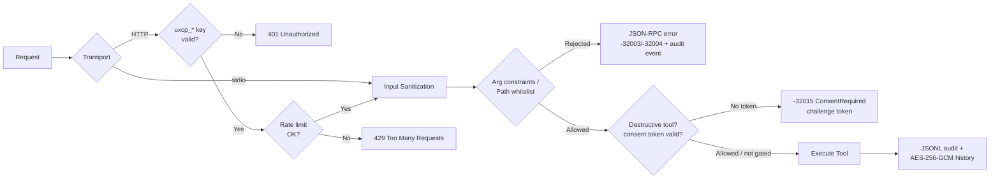
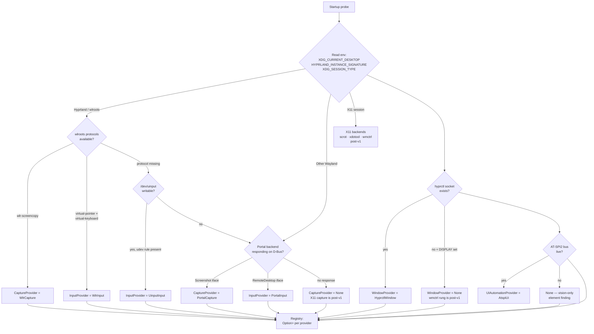
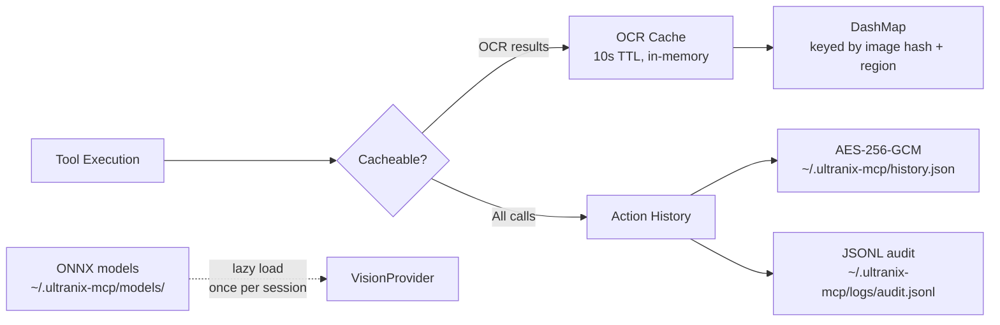
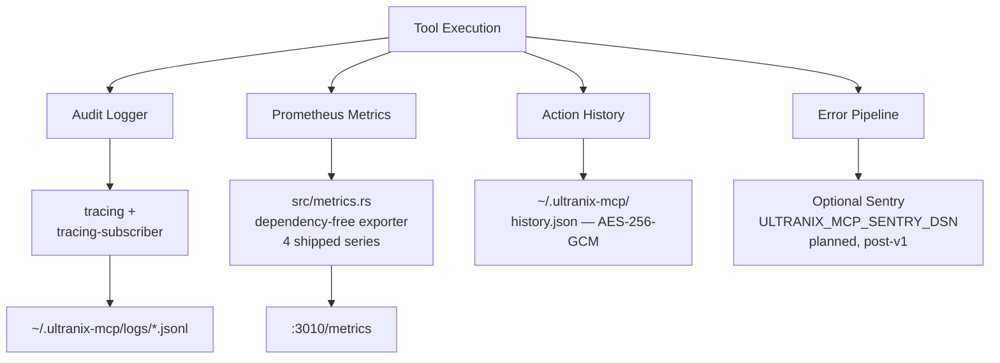
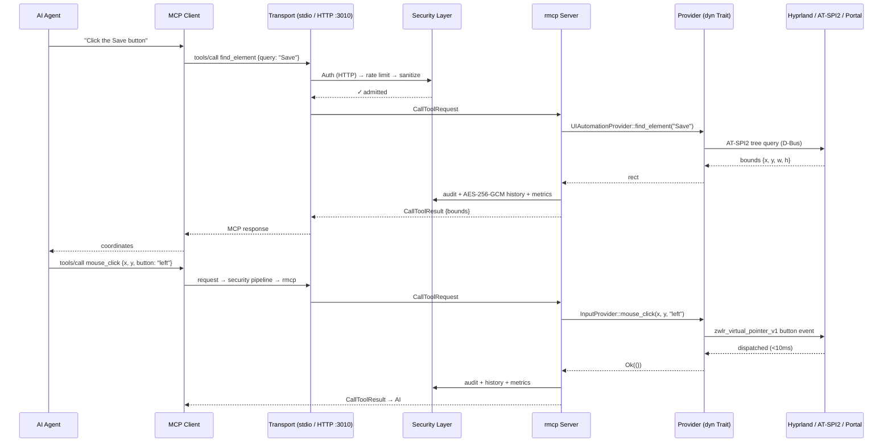
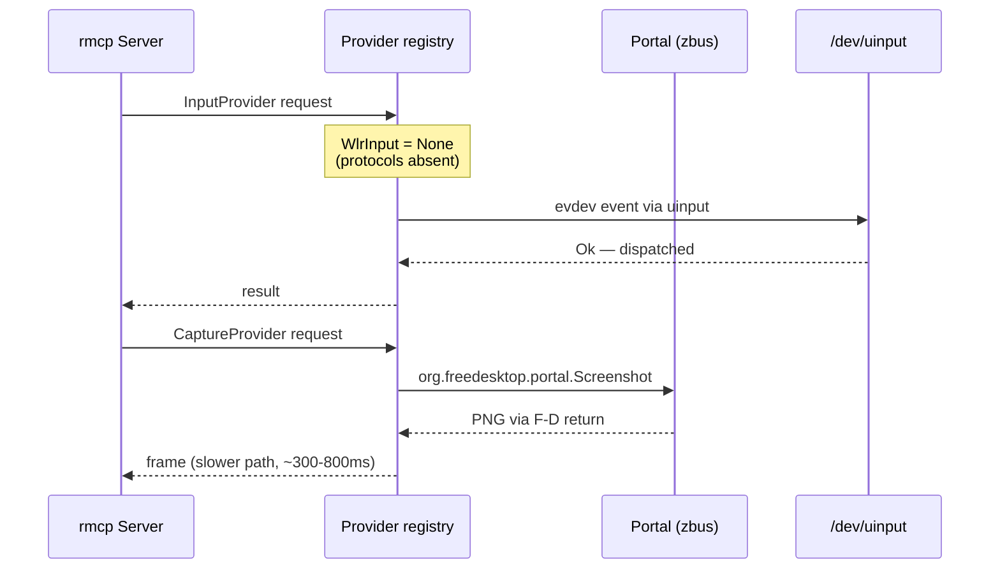

# Architecture Overview

> **Status:** Implemented (v1.0.0) — all six phases of the plan in
> [Implementation Phases](#implementation-phases) have shipped. Items that
> remain unimplemented are marked inline as **planned / post-v1** (optional
> Sentry reporting, PipeWire stream consumption on the portal
> RemoteDesktop path, X11-native provider rungs, and the four planned
> metrics in §7).

ultranix-mcp is a Model Context Protocol (MCP) server providing complete Linux
desktop-automation capabilities through AI-accessible tools. It is the Linux sibling
of **ultramac-mcp** (macOS, TypeScript/Bun + FastMCP) and **ultrawin-mcp** (Windows,
Rust), and inherits ultrawin's trait-provider architecture while upgrading the MCP
substrate to the official `rmcp` Rust SDK.

- **Language / runtime:** Rust 2024 edition on tokio (verified toolchain: Rust 1.98.1)
- **MCP SDK:** `rmcp` (official `modelcontextprotocol/rust-sdk`)
- **Transports:** stdio + streamable-HTTP on `:3010`
- **Primary target:** Hyprland on Wayland (verified on CachyOS + PipeWire +
  xdg-desktop-portal-hyprland + AT-SPI2), with graceful degradation to generic
  wlroots, uinput/evdev, XDG Desktop Portal, and X11 fallback paths.

## System Design

```mermaid
graph TB
    subgraph "Client Layer"
        AI[AI Assistant/Agent]
        MCP[MCP Client]
    end

    subgraph "Transport Layer"
        HTTP[Streamable HTTP :3010]
        STDIO[STDIO]
    end

    subgraph "Security Layer"
        AUTH[uxcp_* API Key Auth<br/>HTTP only · fail-closed]
        RATE[Rate Limiter<br/>10 req/sec token bucket]
        SANITIZE[Input Sanitization]
        ARGC[Arg-Constrained Exec<br/>grim · slurp · hyprctl* · scrot<br/>xdotool · wmctrl (X11 only)]
        PATHS[Path Whitelist<br/>$XDG_RUNTIME_DIR · /tmp · ~/.ultranix-mcp/**]
        CONSENT[Consent Gate<br/>destructive tools · -32015<br/>token bound to key_id/session + args_hash]
    end

    subgraph "Core Server (rmcp)"
        RMCP[rmcp ServerHandler]
        TOOLS[32 Automation Tools<br/>5 categories · --category filter]
    end

    subgraph "Tool Categories"
        MOUSE[mouse · 7 tools]
        KB[keyboard · 2 tools]
        VISION[vision · 12 tools]
        AUTO[automation · 4 tools]
        ADMIN[admin · 7 tools]
    end

    subgraph "Provider Traits — Option<Arc<dyn Trait>> DI"
        PCAP[CaptureProvider]
        PIN[InputProvider]
        PUIA[UIAutomationProvider]
        PWIN[WindowProvider]
        PVIS[VisionProvider]
        PBRW[BrowserProvider]
    end

    subgraph "Backend Implementations"
        WLR[wlroots-native<br/>wlr-screencopy · virtual-pointer<br/>virtual-keyboard]
        UIN[uinput / evdev<br/>udev rule, no compositor dependency]
        PORTAL[XDG Desktop Portal<br/>Screenshot · RemoteDesktop via zbus]
        HYPR[hyprctl IPC<br/>$XDG_RUNTIME_DIR/hypr/$HYPRLAND_INSTANCE_SIGNATURE/.socket.sock]
        ATSPI[AT-SPI2<br/>atspi crate]
        ORT[ort / ONNX Runtime<br/>CPU → OpenVINO → CUDA]
        CDP[Chrome DevTools Protocol<br/>127.0.0.1:9222]
    end

    subgraph "Desktop Environment"
        COMPOSITOR[Hyprland / wlroots Compositor]
        WAYLAND[Wayland Protocol Layer]
        DBUS[Session D-Bus<br/>AT-SPI2 · Portals]
        PIPEWIRE[PipeWire]
        X11[XWayland / X11 fallback]
    end

    subgraph "Observability"
        HEALTH[Health Endpoints<br/>/health · /readyz]
        METRICS[Prometheus /metrics<br/>4 shipped series]
        AUDIT[JSONL Audit Log]
        HISTORY[AES-256-GCM<br/>Action History]
        SENTRY[Optional Sentry<br/>planned, post-v1]
    end

    AI --> MCP
    MCP --> HTTP
    MCP --> STDIO
    HTTP --> AUTH
    STDIO --> SANITIZE
    AUTH --> RATE
    RATE --> SANITIZE
    SANITIZE --> ARGC
    ARGC --> PATHS
    PATHS --> CONSENT
    CONSENT --> RMCP
    RMCP --> TOOLS
    TOOLS --> MOUSE
    TOOLS --> KB
    TOOLS --> VISION
    TOOLS --> AUTO
    TOOLS --> ADMIN
    MOUSE --> PIN
    KB --> PIN
    VISION --> PCAP
    VISION --> PUIA
    VISION --> PVIS
    AUTO --> PIN
    AUTO --> PBRW
    ADMIN --> PWIN
    PCAP --> WLR
    PCAP --> PORTAL
    PIN --> WLR
    PIN --> UIN
    PIN --> PORTAL
    PUIA --> ATSPI
    PWIN --> HYPR
    PWIN --> X11
    PVIS --> ORT
    PBRW --> CDP
    WLR --> WAYLAND
    PORTAL --> DBUS
    ATSPI --> DBUS
    HYPR --> COMPOSITOR
    X11 --> COMPOSITOR
    WAYLAND --> COMPOSITOR
    COMPOSITOR --> PIPEWIRE
    RMCP --> HEALTH
    RMCP --> METRICS
    RMCP --> AUDIT
    RMCP --> HISTORY
    RMCP --> SENTRY
```

## Component Architecture

### 1. Transport Layer (rmcp)

ultranix-mcp uses **`rmcp`**, the official Model Context Protocol Rust SDK
(`modelcontextprotocol/rust-sdk`) — an upgrade over ultrawin's `mcp-sdk-rs` plus
hand-rolled `lsp_transport.rs`. rmcp provides first-class transports, generated
JSON-RPC framing, and upstream tracking of the MCP specification.

| Transport | Endpoint | Auth | Use case |
| --------- | -------- | ---- | -------- |
| **stdio** | stdin/stdout JSON-RPC | Not applicable (inherits the spawning client's trust boundary) | Claude Desktop / Claude Code / local agent launchers |
| **Streamable HTTP** | `http://127.0.0.1:3010/mcp` (canonical JSON-RPC endpoint path) | `X-API-Key: uxcp_*` key required (`Authorization: Bearer` accepted); **fail-closed** — no listener without a configured key | Remote agent runtimes, browser-based clients, shared workstations |

- **Bind address:** `127.0.0.1:3010` by default; the HTTP listener is loopback-only
  unless explicitly re-bound — the server automates the *local* GUI session, so
  non-loopback exposure is opt-in and still requires a valid `uxcp_*` key.
- **Configuration:** `ULTRANIX_MCP_API_KEY` supplies the expected key. Auth is
  **fail-closed**: when no key is configured the server refuses to bind `:3010`
  rather than listen unauthenticated, and no development key is ever generated.
  `ULTRANIX_MCP_DISABLE_AUTH=true` is an explicit operator opt-out that bypasses
  HTTP auth for trusted local development.
- **Health endpoints** (`/health`, `/readyz`) and `/metrics` ride the same HTTP
  listener but are exempt from rate limiting so Prometheus scrapes and systemd
  watchdog checks are not starved. The canonical MCP JSON-RPC endpoint on that
  listener is `POST /mcp` — the path other documents (HEADLESS_AUTH.md,
  API_KEY_MANAGEMENT.md, PACKAGING.md) reference.

### 2. Security Layer



**Components (all under `src/security/`):**

- **API key validation** — constant-time comparison of `uxcp_*`-prefixed keys
  supplied via `X-API-Key` (canonical) or `Authorization: Bearer` against
  `ULTRANIX_MCP_API_KEY`; HTTP transport only and **fail-closed** (no `:3010`
  bind without a configured key; no dev-key generation).
  `ULTRANIX_MCP_DISABLE_AUTH=true` is an explicit operator opt-out for local
  development.
- **Rate limiter** — token bucket, 10 requests/second per client identity.
- **Input sanitization** — shell-metacharacter stripping, control-character removal,
  length caps on all string arguments before they reach a tool handler.
- **Arg-constrained exec** — `system_command` may only invoke
  `grim`, `slurp`, `hyprctl`, `scrot`, `xdotool`, `wmctrl`, each restricted to
  a per-binary set of sanctioned subcommands/flags (e.g. `hyprctl` is limited
  to `clients`, `activewindow`, `monitors`, `workspaces`, and
  `dispatch focuswindow|movewindow|resizewindow|workspace|movetoworkspace`;
  `dispatch exec`/`exec-once` are denied). `xdotool`/`wmctrl` are registered
  on X11-fallback sessions only. Binaries are pinned to absolute paths
  resolved once at startup. `busctl`/`gdbus` are not permitted — D-Bus work
  is in-process via `zbus`.
- **Path whitelist** — file paths must resolve beneath `$XDG_RUNTIME_DIR`,
  `/tmp`, or `~/.ultranix-mcp/**` after symlink/canonicalization checks.
  `$HOME` at large is *not* an allowed root.
- **Consent gate** — destructive tools (`system_command`, `replay_action`,
  `clear_action_history`, `window_control{action:"close"}`) return `-32015
  ConsentRequired` with a single-use, 60-second, CSPRNG-generated challenge
  token bound to the caller (`key_id` on HTTP, session id on stdio), the tool
  name, and `args_hash`; the retried call must carry `consent_token`, and a
  `replay_action` never inherits the original call's consent.
  `--allow-destructive` bypasses the gate (operator opt-out; still audited).
- **Audit & history** — every tool call emits a JSONL audit record to
  `~/.ultranix-mcp/logs/audit.jsonl` (fields: timestamp, `key_id`, tool,
  `args_hash` — never raw arguments — `prev_hash` chain for tamper evidence,
  outcome, duration; 30-day rotation by default) and an AES-256-GCM-encrypted
  entry to `~/.ultranix-mcp/history.json` (key material from
  `ULTRANIX_MCP_HISTORY_SECRET` or a generated per-install secret; the dev
  fallback warns loudly).

### 3. Tool Execution Layer

**32 snake_case tools in 5 categories**, gated by `--category=` at startup to
control token cost of `tools/list` for context-sensitive agents
([TOOLS.md](TOOLS.md) is the canonical tool catalog):

| Category | Tools | Primary providers |
| -------- | ----- | ----------------- |
| **mouse** (7) | `mouse_click`, `mouse_double_click`, `mouse_move`, `mouse_get_position`, `mouse_scroll`, `mouse_drag`, `mouse_button_control` | `InputProvider` |
| **keyboard** (2) | `type_text`, `key_control` | `InputProvider` |
| **vision** (12) | `screenshot`, `screen_info`, `screen_highlight`, `color_at`, `set_spatial_focus`, `get_ui_tree`, `get_focused_element`, `find_element`, `invoke_element`, `find_text_on_screen`, `find_icon`, `wait_for_ui_element` | `CaptureProvider`, `UIAutomationProvider`, `VisionProvider` |
| **automation** (4) | `sleep`, `mouse_move_path`, `system_command`, `web_query` | `InputProvider`, `BrowserProvider`, security layer |
| **admin** (7) | `window_control`, `get_windows`, `get_active_window`, `metrics`, `get_action_history`, `replay_action`, `clear_action_history` | `WindowProvider`, observability subsystem |

Every tool handler follows the same pipeline: schema validation → sanitization →
provider dispatch → structured `CallToolResult` → audit/history/metrics emission.
A tool whose required provider is `None` returns a structured *capability
unavailable* error — never a panic and never an opaque transport failure.

### 4. Provider Abstraction Layer

The core design inheritance from ultrawin: **all OS coupling lives behind six
async traits**, injected as `Option<Arc<dyn Trait>>` at server construction.

| Trait | Responsibility | Implementations (priority order — summary; the canonical fallback-chain table is in §5) |
| ----- | -------------- | -------------------------------- |
| `CaptureProvider` | Frame capture, region capture, output geometry | `WlrCapture` → `GrimCapture` → `PortalCapture` (an `scrot`/X11 rung is post-v1) |
| `InputProvider` | Pointer motion/buttons/scroll, keyboard text & key events | `WlrInput` → `UinputInput` → `PortalInput` (`xdotool`/X11 rung: post-v1) |
| `UIAutomationProvider` | UI tree, focused element, element lookup, AT-SPI action invocation (`invoke_element`) | `AtspiUi` → `None` (vision-only fallback) |
| `WindowProvider` | Window list/focus/move/resize, active window | `HyprctlWindow` → `None` (`wmctrl`/X11 rung: post-v1) |
| `VisionProvider` | OCR (`recognize_text`), zero-shot icon finding (`locate_icon`) | `OnnxVision` (ort: CPU EP; OpenVINO/CUDA behind `vision-openvino`/`vision-cuda` cargo features) |
| `BrowserProvider` | DOM query/eval over CDP | `CdpBrowser` @ `127.0.0.1:9222` |

**Dependency injection** mirrors ultrawin's `build_server` signature: `main.rs`
probes each backend, wraps successes in `Some(Arc::new(..) as Arc<dyn Trait>)`,
logs failures, and passes `None` through — so the server boots on *any* Linux
session and degrades per-capability rather than failing to start. All traits are
`Send + Sync`, object-safe, and mockable for hermetic unit tests.

### 5. Backend Detection & Fallback

Backend selection happens **once at startup** in `src/backend/detect.rs`, driven
by environment probing — `XDG_CURRENT_DESKTOP` plus compositor-specific variables
(`HYPRLAND_INSTANCE_SIGNATURE`, `WAYLAND_DISPLAY`, `DISPLAY`, `XDG_SESSION_TYPE`)
— and protocol-availability checks on the live Wayland connection.



**Per-provider fallback chains** (evaluated in order; first success wins).
*This table is the canonical normative source for fallback ordering* — other
documents (including §4 above and TOOLS.md) summarize or reference it rather
than restating it:

| Provider | Chain (shipped at v1.0.0) |
| -------- | ----- |
| Capture | `wlr-screencopy-unstable-v1` (in-process) → `grim`/`slurp` → XDG Portal `Screenshot` (zbus) → `None` |
| Input | `zwlr_virtual_pointer_v1` + `virtual-keyboard-unstable-v1` (no root on Hyprland) → `/dev/uinput` + evdev → Portal `RemoteDesktop` → `None` |
| Window | `hyprctl` IPC socket → `None` |
| UI Automation | AT-SPI2 via `atspi` crate → `None` |
| Vision | `ort` ONNX: CPU EP → OpenVINO/CUDA EPs behind `vision-openvino`/`vision-cuda` features → `None` |
| Browser | CDP WebSocket `127.0.0.1:9222` → `None` |

**Post-v1 rungs (not yet implemented):** X11-native providers —
`scrot` capture, `xdotool` input, `wmctrl` window control — plus PipeWire
stream consumption on the portal `RemoteDesktop` path (today
`SelectSources` is used only for output geometry; the video fd is never
opened). The `scrot`/`xdotool`/`wmctrl` entries in the `system_command`
whitelist are already enforced on X11 sessions, but no provider rungs
exist yet — on an X11 session the shipped ladders resolve to
`Portal`/`UInput`/`Atspi`/`Onnx`/`Cdp` only and `WindowProvider` stays
`None`.

**hyprctl IPC:** `WindowProvider` speaks JSON over the Unix socket at
`$XDG_RUNTIME_DIR/hypr/$HYPRLAND_INSTANCE_SIGNATURE/.socket.sock` (the same wire
protocol as `hyprctl -j`), avoiding process spawn on the hot path; the
arg-constrained `hyprctl` binary remains the fallback for
`system_command`-driven window ops.

**uinput fallback:** `UinputInput` requires the documented udev rule
(`packaging/99-ultranix-mcp-uinput.rules`:
`SUBSYSTEM=="uinput", MODE="0660", GROUP="ultranix-input", OPTIONS+="static_node=uinput"`,
with the
ultranix-mcp service user as the only member of the dedicated
`ultranix-input` group — never the broad `input` group) — no
root daemon, no `ydotoold` service.

### 6. Caching & History



**Components:**

- **OCR cache** — *planned, post-v1*: a 10-second TTL in-memory cache keyed by
  hash of the captured frame + requested region is designed but not yet wired;
  every `find_text_on_screen` call currently re-runs inference.
- **Action history** — every tool call appended to
  `~/.ultranix-mcp/history.json`, AES-256-GCM encrypted at rest (key material from
  `ULTRANIX_MCP_HISTORY_SECRET` or a generated per-install secret under
  `~/.ultranix-mcp/`, mode 0700); powers `get_action_history` and `replay_action`.
- **Model cache** — ONNX weights (OCR + OWL-ViT) under
  `~/.ultranix-mcp/models/`, downloaded on first vision call, pinned by SHA-256.
- **Spatial-focus state** — `set_spatial_focus` stores a process-global
  `RwLock<Option<Rect>>` (no session handle exists in the dispatch layer, so
  the rect is shared process-wide) that scopes `screenshot`,
  `find_text_on_screen`, and `find_icon`; it is never persisted.

### 7. Observability



**The 4 shipped Prometheus series** — *this table is the canonical normative
source for the metric catalog*; every other document (including the `metrics`
tool reference in TOOLS.md) references these names rather than restating
them. The registry is the dependency-free exporter in `src/metrics.rs` — no
`prometheus` crate.

| Metric | Type | Labels | Description |
| ------ | ---- | ------ | ----------- |
| `ultranix_mcp_tool_calls_total` | Counter | `tool`, `outcome` | Tool call count by outcome (`ok`, `tool_error`, `consent_required`, `error`) |
| `ultranix_mcp_tool_duration_seconds` | Histogram | `tool` | Per-tool execution latency (fixed-bucket `_bucket{le}` / `_sum` / `_count`) |
| `ultranix_mcp_rate_limit_rejections_total` | Counter | `category` | 429 rejections |
| `ultranix_mcp_active_sessions` | Gauge | `transport` | Live stdio/HTTP sessions |

**Planned additions (Phase-6 / post-v1 — not yet emitted):**
`ultranix_mcp_auth_failures_total{transport}`,
`ultranix_mcp_backend_active{backend}`,
`ultranix_mcp_action_history_size`, and
`ultranix_mcp_ocr_cache_entries` (the OCR cache itself is not yet wired —
see §6).

Health endpoints: `/health` (process alive, <10ms cached) and `/readyz` (reports
which of the six providers resolved to `Some`, enabling precise readiness gating).

## Data Flow

### Typical Request Flow (`find_element` → click)



### Degraded-path flow (non-wlroots session)



## Technology Stack

| Layer | Technology | Version / Notes |
| ----- | ---------- | --------------- |
| **Language** | Rust | 2024 edition, toolchain 1.98.1 (verified) |
| **Runtime** | tokio | 1.x, `full` features |
| **MCP SDK** | `rmcp` (`modelcontextprotocol/rust-sdk`) | official; stdio + streamable-HTTP transports |
| **Wayland protocols** | `wayland-client` + `wayland-protocols-wlr` | wlr-screencopy-unstable-v1, zwlr_virtual_pointer_v1, virtual-keyboard-unstable-v1 |
| **D-Bus** | `zbus` | XDG Desktop Portal (Screenshot, RemoteDesktop) |
| **Accessibility** | `atspi` | AT-SPI2 client |
| **Kernel input** | `evdev` / `uinput` crates | fallback input path |
| **Compositor IPC** | Unix socket JSON (hyprctl wire protocol) | `$XDG_RUNTIME_DIR/hypr/$HYPRLAND_INSTANCE_SIGNATURE/.socket.sock` |
| **ML inference** | `ort` (ONNX Runtime) | EPs: CPU → OpenVINO → CUDA; OCR + OWL-ViT |
| **Browser bridge** | `tokio-tungstenite` CDP client | `127.0.0.1:9222` |
| **Crypto** | `aes-gcm` | AES-256-GCM history encryption |
| **Serialization** | `serde` / `serde_json` | schemas, history, audit |
| **Logging** | `tracing` + `tracing-subscriber` | JSONL to `~/.ultranix-mcp/logs/` |
| **Metrics** | `src/metrics.rs` — dependency-free Prometheus text exporter | `/metrics` on :3010 |
| **Errors** | `anyhow` + `thiserror` | provider internals / tool surfaces |
| **Error reporting** | `sentry` — planned, post-v1 | `ULTRANIX_MCP_SENTRY_DSN` (documented, not wired) |
| **Testing** | `cargo test` + `tokio::test` + golden MCP fixtures | see TESTING_STRATEGY.md |

## Security Architecture

### Defense in Depth

```mermaid
graph TD
    INPUT[Client Request] --> L0{Transport}
    L0 -->|HTTP :3010| L1[Layer 1: uxcp_* API Key Auth<br/>fail-closed]
    L0 -->|stdio| L2
    L1 --> L2[Layer 2: Rate Limiting<br/>10 req/s token bucket]
    L2 --> L3[Layer 3: Input Sanitization]
    L3 --> L4[Layer 4: Arg-Constrained Exec<br/>grim · slurp · hyprctl* · scrot<br/>xdotool · wmctrl — X11 only]
    L4 --> L5[Layer 5: Path Whitelist<br/>$XDG_RUNTIME_DIR · /tmp · ~/.ultranix-mcp/**]
    L5 --> L6[Layer 6: Consent Gate<br/>destructive tools · -32015 challenge<br/>key_id/session-bound token]
    L6 --> EXEC[Safe Execution<br/>via provider traits]
    EXEC --> L7[Layer 7: AES-256-GCM<br/>History Encryption]
    L7 --> L8[Layer 8: JSONL Audit Log<br/>key_id · args_hash · prev_hash]
    L8 --> L9[Layer 9: Prometheus /metrics<br/>+ optional Sentry (post-v1)]
```

**Layer notes:**

1. **Authentication** — HTTP-only; stdio inherits the parent process trust boundary.
   `ULTRANIX_MCP_API_KEY` sets the key (`X-API-Key` canonical header, `Bearer`
   accepted); **fail-closed** — the server refuses to bind `:3010` with no key
   configured and never generates a dev key. `ULTRANIX_MCP_DISABLE_AUTH=true`
   is an explicit operator opt-out.
2. **Rate limiting** — 10 req/s token bucket per client; `/metrics` and health
   endpoints exempt.
3. **Sanitization** — applied to *every* transport, including stdio, because tool
   arguments still reach `system_command` and filesystem paths.
4. **Arg-constrained exec** — six binaries, each restricted to a per-binary set
   of sanctioned subcommands/flags; exec-capable `hyprctl` dispatchers
   (`exec`, `exec-once`) denied; absolute binary paths pinned at startup; no
   shell interpolation (`Command::new` + arg vector, never `sh -c`).
5. **Path whitelist** — canonicalization before comparison; symlink escapes
   rejected; roots limited to `$XDG_RUNTIME_DIR`, `/tmp`, `~/.ultranix-mcp/**`.
6. **Consent gate** — destructive tools require a single-use, 60-second,
   CSPRNG-generated `consent_token` bound to `{key_id (HTTP) or session id
   (stdio), tool, args_hash}`; `--allow-destructive` is the
   operator bypass.
7. **History encryption** — AES-256-GCM; key material derived per-install under
   `~/.ultranix-mcp/` (mode 0700); the dev fallback warns loudly.
8. **Audit** — append-only JSONL with timestamp, `key_id`, tool, `args_hash`
   (never raw arguments), `prev_hash` chain, outcome, duration; 30-day
   rotation by default.
9. **Observability** — metrics surface rate-limit spikes and per-tool
   outcomes in real time; Sentry panic/error-chain capture is planned
   post-v1 (`ULTRANIX_MCP_SENTRY_DSN` is documented but not yet wired).

### Threat Model

| Threat | Mitigation |
| ------ | ---------- |
| Command injection via `system_command` | 6-binary arg-constrained set (exec-capable subcommands denied), arg-vector exec (no shell), absolute-path pinning, sanitization, consent gate |
| Directory traversal | Path whitelist (`$XDG_RUNTIME_DIR`, `/tmp`, `~/.ultranix-mcp/**`) + canonicalize-then-compare + symlink rejection |
| Brute-force / abuse over HTTP | 10 req/s token bucket + loopback-only default bind + fail-closed bind when no key is configured |
| Unauthorized access | `uxcp_*` key auth on HTTP (`X-API-Key` canonical, `Bearer` accepted); constant-time compare |
| Destructive-action abuse | Consent gate (`-32015` challenge, single-use 60s CSPRNG tokens bound to `key_id`/session + `args_hash`; replay never inherits consent) + tamper-evident audit (`prev_hash` chain) |
| History disclosure at rest | AES-256-GCM on `history.json`, dir mode 0700 |
| Data exfiltration | JSONL audit trail of every call; metrics on anomalies |
| Resource exhaustion (OCR/vision) | Rate limit + spatial-focus caps + model load once |
| Session hijack of portal prompts | Portal calls carry `org.freedesktop.portal` session tokens; failures degrade to `None`, never escalate privileges |
| Malicious schema payloads | rmcp-generated schema validation; fuzzing of `tools/call` params (see TESTING_STRATEGY.md) |

## Deployment Architecture

### Primary: systemd `--user` service

Desktop automation requires a **seat** — a live Wayland session, a D-Bus session
bus, `$XDG_RUNTIME_DIR`, and access to the compositor socket. ultranix-mcp is
therefore deployed as a per-user systemd unit, *not* Docker-first. *This is
the canonical systemd unit definition* — other documents (PACKAGING.md,
README.md) reference it rather than restating it:

```ini
# ~/.config/systemd/user/ultranix-mcp.service (packaged at /usr/lib/systemd/user/)
[Unit]
Description=ultranix-mcp — MCP server for Linux desktop automation (HTTP :3010)
After=graphical-session.target
PartOf=graphical-session.target
ConditionEnvironment=WAYLAND_DISPLAY

[Service]
Type=simple
# API key: prefer systemd-creds / EnvironmentFile over inline secrets.
EnvironmentFile=-%h/.config/ultranix-mcp/env
Environment=ULTRANIX_MCP_LOG_LEVEL=info
ExecStart=/usr/bin/ultranix-mcp --transport http --bind 127.0.0.1:3010
Restart=on-failure
RestartSec=3

# --- Hardening (must NOT break the session-level backends) ---
NoNewPrivileges=true
ProtectSystem=strict
ProtectHome=read-only
ReadWritePaths=%h/.ultranix-mcp
PrivateTmp=true
ProtectKernelTunables=true
ProtectKernelModules=true
ProtectControlGroups=true
RestrictSUIDSGID=true
SystemCallArchitectures=native
# Deliberately NOT set:
#   PrivateDevices=yes        — would hide /dev/uinput from the evdev fallback.
#   MemoryDenyWriteExecute=yes — ONNX Runtime JIT may need W+X.
#   RestrictNamespaces=yes    — portals spawn helper sockets via userns.

[Install]
WantedBy=graphical-session.target
```

- Binds `graphical-session.target` so `$WAYLAND_DISPLAY`,
  `HYPRLAND_INSTANCE_SIGNATURE`, `XDG_RUNTIME_DIR`, and the AT-SPI2 bus are all live.
- `EnvironmentFile=-%h/.config/ultranix-mcp/env` carries
  `ULTRANIX_MCP_API_KEY` / `ULTRANIX_MCP_HISTORY_SECRET` (see PACKAGING.md §6);
  `ULTRANIX_MCP_DISABLE_AUTH=true` may be set there for loopback-only dev boxes.
- `systemctl --user enable --now ultranix-mcp.service`; logs via
  `journalctl --user -u ultranix-mcp`.
- stdio mode runs with no service at all — the MCP client spawns the binary directly.

### Container deployment (limited, documented)

```mermaid
graph TB
    subgraph "Container — degraded mode"
        APP[ultranix-mcp]
        NOTE["No seat: CaptureProvider = portal-or-None<br/>InputProvider = uinput-if-mapped-or-None<br/>WindowProvider = None"]
    end
    subgraph "Host bindings required"
        RUNTIME[$XDG_RUNTIME_DIR bind-mount]
        DBUSSOCK[session D-Bus socket]
        UINPUT[/dev/uinput device]
    end
    RUNTIME --> APP
    DBUSSOCK --> APP
    UINPUT --> APP
```

Container operation is supported for **headless tooling and CI smoke tests only**;
it requires bind-mounting `$XDG_RUNTIME_DIR` (compositor socket), the session bus,
and `/dev/uinput`, plus matching UID. Even then, wlroots-native paths are
unavailable — expect portal/`None` providers and reduced tool coverage. This is a
documented limitation, not a supported production topology: desktop automation is
inherently single-seat.

## Scalability Considerations

### Hard limits

- **Single GUI session.** The server automates one compositor session; there is no
  horizontal scaling dimension. One process = one seat = one set of providers.
- **Stateful.** Action history and the process-global spatial-focus rect are
  per-instance (the post-v1 OCR cache will be too, when it lands).
- **Vision throughput.** ONNX inference is CPU-bound by default; concurrent
  `find_icon` calls are serialized on the `ort` session.

### Sensible scaling patterns

| Pattern | Description |
| ------- | ----------- |
| **Vertical** | More cores → faster OWL-ViT/OCR; RAM for model cache (~600MB resident) |
| **Multi-seat hosts** | One ultranix-mcp per logged-in user session, isolated by `$XDG_RUNTIME_DIR` and port offset |
| **Federation** | Fleet of Linux desktops, each running the server; an orchestrating agent routes `tools/call` by host |
| **Nested compositor dev** | cage/weston headless instances give parallel, disposable sessions for CI (see TESTING_STRATEGY.md) |

## Performance Characteristics

Targets for the verified environment (CachyOS, Hyprland, PipeWire,
xdg-desktop-portal-hyprland, AT-SPI2 live, Rust 1.98.1):

| Operation | Target | Backend | Notes |
| --------- | ------ | ------- | ----- |
| `mouse_click` dispatch | **<10ms** | zwlr_virtual_pointer_v1 | protocol round-trip only |
| `type_text` (100 chars) | <50ms | virtual-keyboard-unstable-v1 | batched key events |
| `screenshot` (full output) | **<50ms** | wlr-screencopy-unstable-v1 | in-process shm copy |
| `screenshot` (portal path) | <800ms | XDG Portal Screenshot | includes portal round-trip |
| `color_at` | <60ms | 1×1 screencopy + PNG decode | one capture, centre-pixel sample |
| `get_ui_tree` | **<500ms** | AT-SPI2 | full recursive snapshot |
| `get_focused_element` | <100ms | AT-SPI2 | single-node query |
| `find_element` | <500ms | AT-SPI2 | tree scan + match |
| `find_text_on_screen` (cached) | <1ms | OCR cache (10s TTL) | **planned** — the OCR cache is not yet wired; uncached path applies |
| `find_text_on_screen` (uncached) | **<2s** | ort CPU EP | OpenVINO/CUDA reduce further |
| `find_icon` (OWL-ViT) | <2s | ort, EP-dependent | zero-shot, no retraining |
| `get_windows` | <30ms | hyprctl IPC socket | JSON parse of `clients` |
| `web_query` | <200ms | CDP @ 127.0.0.1:9222 | WebSocket eval |
| `/health`, `metrics` tool | <10ms / <5ms | internal | cached/registry read |

## Extension Points

### Adding a new tool

```rust
// In the rmcp tool router — schema, dispatch, and audit are automatic.
#[tool(description = "Describe for the AI agent")]
async fn my_custom_tool(&self, args: MyCustomArgs) -> Result<CallToolResult, ErrorData> {
    // 1. args arrive schema-validated (serde + rmcp macro)
    // 2. sanitize string fields via security::sanitize
    // 3. dispatch to a provider: self.providers.input.mouse_move(..)
    // 4. history + audit + metrics emitted by the shared post-dispatch hook
}
```

### Adding a new backend

Implement the trait, probe it in `src/backend/detect.rs`, and insert it into the
provider's fallback chain — no tool code changes:

```rust
struct SwayMsgWindow; // e.g., a sway-ipc WindowProvider

#[async_trait]
impl WindowProvider for SwayMsgWindow {
    async fn list_windows(&self) -> Result<Vec<WindowInfo>> { /* sway IPC */ }
    async fn focus_window(&self, id: &str) -> Result<()> { /* ... */ }
    // ...
}

// detect.rs — insert after HyprctlWindow in the chain (the wmctrl rung is post-v1).
```

### Registering a custom metric

The exporter is the hand-rolled registry in `src/metrics.rs` (no
`prometheus` dependency). Adding a series means extending the `Registry`
struct and `exposition()` — e.g. the existing call counters are recorded
via:

```rust
crate::metrics::record_call(tool_name, elapsed, "ok");
```

## Implementation Phases

| Phase | Scope | Exit criteria |
| ----- | ----- | ------------- |
| **0 — Scaffold + mocks** | Cargo workspace, rmcp server skeleton (stdio + streamable-HTTP `:3010` transports), all 6 traits + mock providers, `tools/list`/`tools/call` golden | Server lists all 32 tools with mocks; CI green |
| **1 — Hyprland I/O + security scaffolding** | wlr-screencopy capture, virtual-pointer/keyboard input, hyprctl WindowProvider; input sanitization, arg-constrained exec, path whitelist, audit skeleton, consent gate | Screenshot <50ms, click <10ms on real Hyprland; consent challenge on `system_command` |
| **2 — AT-SPI2** | `AtspiUi` provider: tree, focus, find_element, AT-SPI action invocation (`invoke_element`); `set_spatial_focus` shipped process-scoped; `screen_highlight` validates args then returns `-32010 ProviderUnavailable` — the layer-shell overlay is post-v1 | `get_ui_tree` <500ms on live session |
| **3 — Vision + CDP** | ort OCR + OWL-ViT, model cache, `CdpBrowser` | `find_text_on_screen` <2s; `web_query` on :9222 |
| **4 — Enterprise** | HTTP auth surface (`uxcp_*` enforcement on `:3010`, fail-closed bind), token-bucket rate limiting (10 req/s), AES-256-GCM history, JSONL audit rotation, 4 shipped metrics, health endpoints (Sentry: planned post-v1) | Threat-model table fully enforced; `/metrics` live |
| **5 — Portability + packaging** | uinput/portal fallback chains (session-agnostic — they also cover X11 sessions; the X11-native provider rungs are post-v1), systemd unit, packaging | Boots and degrades cleanly on non-Hyprland Wayland and X11 |

## References

- [Model Context Protocol spec](https://modelcontextprotocol.io)
- [rmcp — official Rust SDK](https://github.com/modelcontextprotocol/rust-sdk)
- ultramac-mcp `docs/ARCHITECTURE.md` (sibling, macOS) and ultrawin-mcp `src/traits.rs` / `src/server.rs` / `EVOLUTION_PLAN.md` (sibling, Windows) — trait-provider lineage
- [wlr-screencopy-unstable-v1](https://wayland.app/protocols/wlr-screencopy-unstable-v1), [virtual-keyboard-unstable-v1](https://wayland.app/protocols/virtual-keyboard-unstable-v1), [wlr-virtual-pointer-unstable-v1](https://wayland.app/protocols/wlr-virtual-pointer-unstable-v1)
- [XDG Desktop Portal](https://flatpak.github.io/xdg-desktop-portal/) — Screenshot & RemoteDesktop
- [AT-SPI2 / atspi crate](https://docs.rs/atspi)
- [hyprctl IPC](https://wiki.hyprland.org/IPC/)
- [ort — ONNX Runtime for Rust](https://docs.rs/ort)
- ADRs: [0001](adr/0001-rust-and-rmcp.md) · [0002](adr/0002-wlr-native-input.md) · [0003](adr/0003-atspi2-accessibility.md) · [0004](adr/0004-backend-fallback-chain.md) · [0005](adr/0005-onnx-vision.md) · [0006](adr/0006-tool-naming-and-categories.md)
