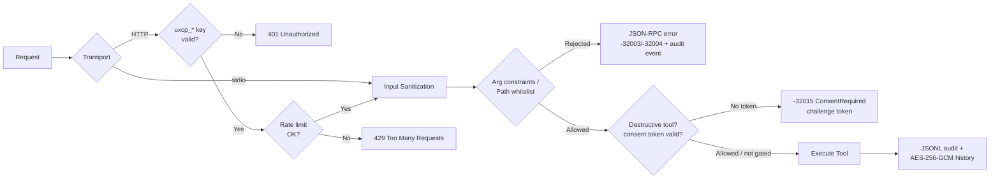
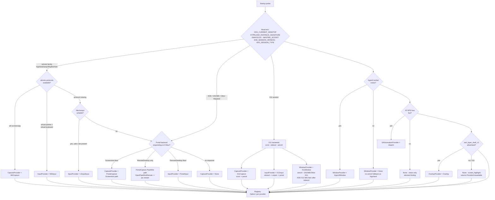
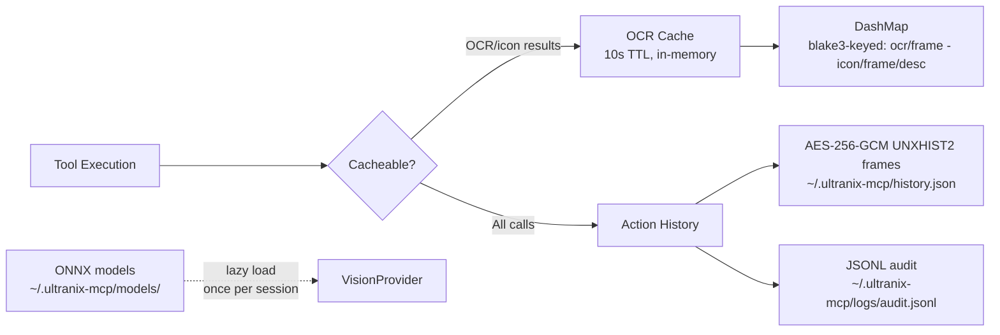
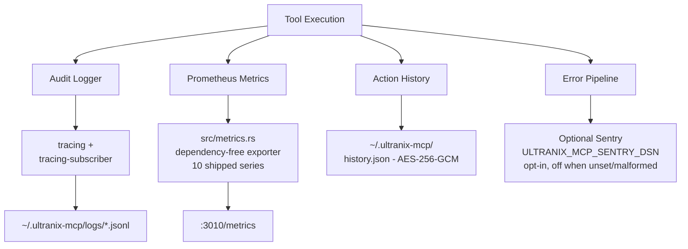
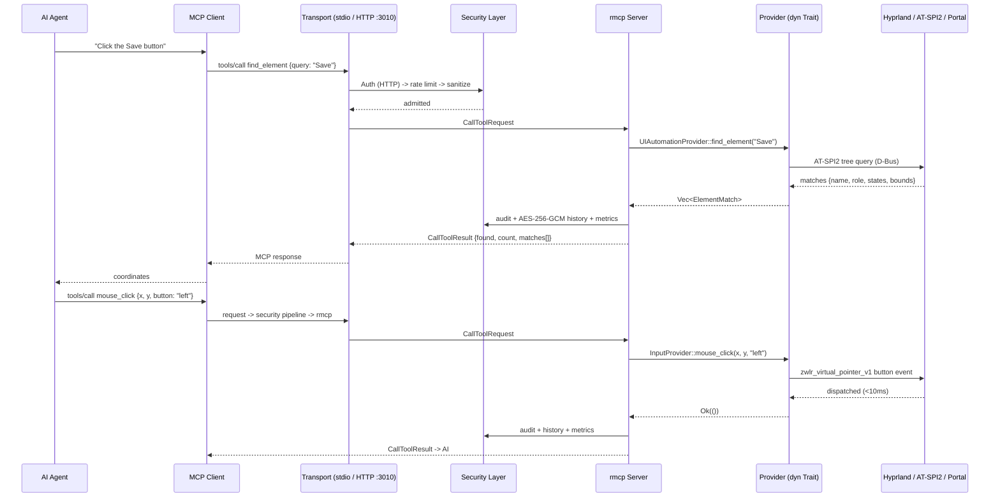

# Architecture Overview

> **Status:**Implemented (v1.4.0) - all six phases of the plan in
> [Implementation Phases](#implementation-phases) have shipped, the
> v1.1.0 wave landed the layer-shell `OverlayProvider`/`screen_highlight`,
> the X11-native provider rungs (`scrot`/`xdotool`/`wmctrl`), PipeWire
> stream consumption on the portal RemoteDesktop path, opt-in Sentry
> reporting, the OCR result cache, and the four additional metrics in §7 -
> and the v1.2.0 breadth wave added the `ClipboardProvider` + clipboard
> tool category, plugin tool-macros (`plugin_list`/`plugin_run`/
> `plugin_reload`), bounded `screen_record`, compositor-breadth session
> detection (sway/Wayfire/river/KDE/GNOME) with the `sway-ipc` window
> provider, the per-backend cargo-feature split, the framed v2 action-
> history format, and the AT-SPI element-scan cache. The v1.3.0
> policy-and-governance wave then added the fail-closed TOML runtime
> access-control policy (`--policy`, default
> `~/.config/ultranix-mcp/policy.toml`; `default_role`/`roles`/`keys`
> with per-key scoping on HTTP), the `--readonly`/`--allow-tools`/
> `--deny-tools` CLI overrides scoped to `default_role`, the `-32018
> ReadOnlyMode`/`-32019 NotInToolList` policy-denial codes, `denied` in
> the tool-call outcome vocabulary, the `ultranix_mcp_backend_calls_total`
> and `ultranix_mcp_build_info` series (10 shipped in §7), and optional
> per-line HMAC-SHA256 signing of `audit.jsonl` via
> `ULTRANIX_MCP_AUDIT_SECRET` (ADR 0010). The v1.4.0 reach wave (ADR 0011)
> closed the remaining compositor window rungs - `wayfire-ipc`
> (`$WAYFIRE_SOCKET`, `ipc`/`ipc-rules` plugins), `riverctl` (river,
> focused-view-only rung: no window-list IPC exists, so
> `get_windows`/`get_active_window` return `isError` results while
> `window_control` drives the focused view), and
> `gnome-shell`
> (the Window Calls Shell extension on session D-Bus) - shipped
> `screen_stream` (rolling-window live capture under `stream-<ulid>`,
> 40 tools total), added dynamic plugin tool registration (manifest
> `tool` sections -> first-class `tools/list` entries routed through
> secured `plugin_run` dispatch), and landed the distribution artifacts
> (root `Dockerfile` + `oci.yml` publishing `ghcr.io/jxoesneon/
> ultranix-mcp` on tags, `packaging/ultranix-mcp-bin/`, `.SRCINFO`
> files, docs/HEADLESS.md).
> Items that remain unimplemented are marked inline as **planned /
> post-v1**.

ultranix-mcp is a Model Context Protocol (MCP) server providing complete Linux
desktop-automation capabilities through AI-accessible tools. It is the Linux sibling
of **ultramac-mcp**(macOS, TypeScript/Bun + FastMCP) and **ultrawin-mcp**(Windows,
Rust), and inherits ultrawin's trait-provider architecture while upgrading the MCP
substrate to the official `rmcp` Rust SDK.

- **Language / runtime:**Rust 2024 edition on tokio (verified toolchain: Rust 1.98.1)
- **MCP SDK:**`rmcp` (official `modelcontextprotocol/rust-sdk`)
- **Transports:**stdio + streamable-HTTP on `:3010`
- **Primary target:**Hyprland on Wayland (verified on CachyOS + PipeWire +
  xdg-desktop-portal-hyprland + AT-SPI2), with graceful degradation to generic
  wlroots, uinput/evdev, XDG Desktop Portal, and X11 fallback paths.

## System Design

```mermaid
graph TB
    subgraph "Client Layer"
        AI[AI Assistant/Agent]
        MCP[MCP Client]
    end

    subgraph "Transport Layer"
        HTTP[Streamable HTTP :3010]
        STDIO[STDIO]
    end

    subgraph "Security Layer"
        AUTH[uxcp_* API Key Auth<br/>HTTP only - fail-closed]
        RATE[Rate Limiter<br/>10 req/sec token bucket]
        SANITIZE[Input Sanitization]
        ARGC[Arg-Constrained Exec<br/>grim - slurp - hyprctl* - scrot<br/>xdotool - wmctrl (X11 only)]
        PATHS[Path Whitelist<br/>$XDG_RUNTIME_DIR - /tmp - ~/.ultranix-mcp/**]
        CONSENT[Consent Gate<br/>destructive tools - -32015<br/>token bound to key_id/session + args_hash]
    end

    subgraph "Core Server (rmcp)"
        RMCP[rmcp ServerHandler]
        TOOLS[40 Automation Tools<br/>6 categories - --category filter<br/>+ plugin-exposed dynamic tools]
    end

    subgraph "Tool Categories"
        MOUSE[mouse - 7 tools]
        KB[keyboard - 2 tools]
        VISION[vision - 14 tools]
        AUTO[automation - 4 tools]
        ADMIN[admin - 10 tools]
        CLIP[clipboard - 3 tools]
    end

    subgraph "Provider Traits - Option<Arc<dyn Trait>> DI"
        PCAP[CaptureProvider]
        PIN[InputProvider]
        PUIA[UIAutomationProvider]
        PWIN[WindowProvider]
        PVIS[VisionProvider]
        PBRW[BrowserProvider]
        POVL[OverlayProvider]
        PCLIP[ClipboardProvider]
    end

    subgraph "Backend Implementations"
        WLR[wlroots-native<br/>wlr-screencopy - virtual-pointer<br/>virtual-keyboard - layer-shell<br/>foreign-toplevel]
        UIN[uinput / evdev<br/>udev rule, no compositor dependency]
        PORTAL[XDG Desktop Portal<br/>Screenshot - RemoteDesktop+PipeWire via zbus]
        HYPR[hyprctl IPC<br/>$XDG_RUNTIME_DIR/hypr/$HYPRLAND_INSTANCE_SIGNATURE/.socket.sock]
        SWAY[sway IPC<br/>$SWAYSOCK - i3-flavoured wire protocol]
        X11B[X11-native<br/>scrot - xdotool - wmctrl]
        ATSPI[AT-SPI2<br/>atspi crate]
        ORT[ort / ONNX Runtime<br/>CPU -> OpenVINO -> CUDA -> ROCm]
        CDP[Chrome DevTools Protocol<br/>127.0.0.1:9222]
        WLC[Clipboard helpers<br/>wl-copy/wl-paste - xclip/xsel]
    end

    subgraph "Desktop Environment"
        COMPOSITOR[Compositor Session<br/>Hyprland - sway - Wayfire - river<br/>KDE - GNOME - Other]
        WAYLAND[Wayland Protocol Layer]
        DBUS[Session D-Bus<br/>AT-SPI2 - Portals]
        PIPEWIRE[PipeWire]
        X11[XWayland / X11 fallback]
    end

    subgraph "Observability"
        HEALTH[Health Endpoints<br/>/health - /readyz]
        METRICS[Prometheus /metrics<br/>10 shipped series]
        AUDIT[JSONL Audit Log]
        HISTORY[AES-256-GCM<br/>Action History]
        SENTRY[Optional Sentry<br/>opt-in via ULTRANIX_MCP_SENTRY_DSN]
    end

    AI --> MCP
    MCP --> HTTP
    MCP --> STDIO
    HTTP --> AUTH
    STDIO --> SANITIZE
    AUTH --> RATE
    RATE --> SANITIZE
    SANITIZE --> ARGC
    ARGC --> PATHS
    PATHS --> CONSENT
    CONSENT --> RMCP
    RMCP --> TOOLS
    TOOLS --> MOUSE
    TOOLS --> KB
    TOOLS --> VISION
    TOOLS --> AUTO
    TOOLS --> ADMIN
    TOOLS --> CLIP
    MOUSE --> PIN
    KB --> PIN
    VISION --> PCAP
    VISION --> PUIA
    VISION --> PVIS
    AUTO --> PIN
    AUTO --> PBRW
    ADMIN --> PWIN
    CLIP --> PCLIP
    PCAP --> WLR
    PCAP --> PORTAL
    PCAP --> X11B
    PIN --> WLR
    PIN --> UIN
    PIN --> PORTAL
    PIN --> X11B
    PUIA --> ATSPI
    PWIN --> HYPR
    PWIN --> SWAY
    PWIN --> X11B
    PVIS --> ORT
    PBRW --> CDP
    VISION --> POVL
    POVL --> WLR
    PCLIP --> WLC
    WLR --> WAYLAND
    PORTAL --> DBUS
    PORTAL --> PIPEWIRE
    ATSPI --> DBUS
    HYPR --> COMPOSITOR
    SWAY --> COMPOSITOR
    X11B --> X11
    X11 --> COMPOSITOR
    WAYLAND --> COMPOSITOR
    COMPOSITOR --> PIPEWIRE
    WLC --> WAYLAND
    WLC --> X11
    RMCP --> HEALTH
    RMCP --> METRICS
    RMCP --> AUDIT
    RMCP --> HISTORY
    RMCP --> SENTRY
```

## Component Architecture

### 1. Transport Layer (rmcp)

ultranix-mcp uses **`rmcp`**, the official Model Context Protocol Rust SDK
(`modelcontextprotocol/rust-sdk`) - an upgrade over ultrawin's `mcp-sdk-rs` plus
hand-rolled `lsp_transport.rs`. rmcp provides first-class transports, generated
JSON-RPC framing, and upstream tracking of the MCP specification.

| Transport | Endpoint | Auth | Use case |
| --------- | -------- | ---- | -------- |
| **stdio**| stdin/stdout JSON-RPC | Not applicable (inherits the spawning client's trust boundary) | Claude Desktop / Claude Code / local agent launchers |
| **Streamable HTTP**| `http://127.0.0.1:3010/mcp` (canonical JSON-RPC endpoint path) | `X-API-Key: uxcp_*` key required (`Authorization: Bearer` accepted); **fail-closed**- no listener without a configured key | Remote agent runtimes, browser-based clients, shared workstations | - **Bind address:**`127.0.0.1:3010` by default; the HTTP listener is loopback-only
  unless explicitly re-bound - the server automates the *local* GUI session, so
  non-loopback exposure is opt-in and still requires a valid `uxcp_*` key.
- **Configuration:**`ULTRANIX_MCP_API_KEY` supplies the expected key. Auth is
  **fail-closed**: when no key is configured the server refuses to bind `:3010`
  rather than listen unauthenticated, and no development key is ever generated.
  `ULTRANIX_MCP_DISABLE_AUTH=true` is an explicit operator opt-out that bypasses
  HTTP auth for trusted local development.
- **Health endpoints**(`/health`, `/readyz`) and `/metrics` ride the same HTTP
  listener but are exempt from rate limiting so Prometheus scrapes and systemd
  watchdog checks are not starved. The canonical MCP JSON-RPC endpoint on that
  listener is `POST /mcp` - the path other documents (HEADLESS_AUTH.md,
  API_KEY_MANAGEMENT.md, PACKAGING.md) reference.

### 2. Security Layer



**Components (all under `src/security/`):**

- **API key validation**- constant-time comparison of `uxcp_*`-prefixed keys
  supplied via `X-API-Key` (canonical) or `Authorization: Bearer` against
  `ULTRANIX_MCP_API_KEY`; HTTP transport only and **fail-closed**(no `:3010`
  bind without a configured key; no dev-key generation).
  `ULTRANIX_MCP_DISABLE_AUTH=true` is an explicit operator opt-out for local
  development.
- **Rate limiter**- token bucket, 10 requests/second per client identity.
- **Input sanitization**- shell-metacharacter stripping, control-character removal,
  length caps on all string arguments before they reach a tool handler.
- **Arg-constrained exec**- `system_command` may only invoke
  `grim`, `slurp`, `hyprctl`, `scrot`, `xdotool`, `wmctrl`, each restricted to
  a per-binary set of sanctioned subcommands/flags (e.g. `hyprctl` is limited
  to `clients`, `activewindow`, `monitors`, `workspaces`, and
  `dispatch focuswindow|movewindow|resizewindow|workspace|movetoworkspace`;
  `dispatch exec`/`exec-once` are denied). `xdotool`/`wmctrl` are registered
  on X11-fallback sessions only. `xrandr`/`xprop` sit in the startup pin set
  as provider-internal helpers (X11 geometry / `_NET_WM_STATE` reads) but
  have **no**`validate_command` arm - `system_command` cannot invoke them.
  v1.2.0 added `wl-copy`, `wl-paste`, `xclip`, `xsel`, and `kdotool` to the
  same provider-internal pin set (clipboard providers + the shipped
  `KdotoolWindow` KDE rung) - likewise unreachable through `system_command`.
  v1.4.0 added `riverctl` to the same pin-only set for the river window
  rung - pinned and spawned by `RiverWindow`, but with no
  `validate_command` arm.
  Binaries are pinned to absolute paths
  resolved once at startup. `busctl`/`gdbus` are not permitted - D-Bus work
  is in-process via `zbus`.
- **Path whitelist**- file paths must resolve beneath `$XDG_RUNTIME_DIR`,
  `/tmp`, or `~/.ultranix-mcp/**` after symlink/canonicalization checks.
  `$HOME` at large is *not* an allowed root.
- **Consent gate**- destructive tools (`system_command`, `replay_action`,
  `clear_action_history`, `window_control{action:"close"}`,
  `clipboard_set`, `clipboard_clear`) return `-32015
  ConsentRequired` with a single-use, 60-second, CSPRNG-generated challenge
  token bound to the caller (`key_id` on HTTP, session id on stdio), the tool
  name, and `args_hash`; the retried call must carry `consent_token`, and a
  `replay_action` never inherits the original call's consent. Plugin steps
  re-enter the gate - consent for `plugin_run` itself does not authorize a
  destructive step.
  `--allow-destructive` bypasses the gate (operator opt-out; still audited).
- **Audit & history**- every tool call emits a JSONL audit record to
  `~/.ultranix-mcp/logs/audit.jsonl` (fields: timestamp, `key_id`, tool,
  `args_hash` - never raw arguments - `prev_hash` chain for tamper evidence,
  outcome, duration; 30-day rotation by default) and an AES-256-GCM-encrypted
  entry to `~/.ultranix-mcp/history.json` (key material from
  `ULTRANIX_MCP_HISTORY_SECRET` or a generated per-install secret; the dev
  fallback warns loudly).

### 3. Tool Execution Layer

**40 snake_case tools in 6 categories**(plus plugin-exposed dynamic tools
advertised at runtime), gated by `--category=` at startup to
control token cost of `tools/list` for context-sensitive agents
([TOOLS.md](TOOLS.md) is the canonical tool catalog):

| Category | Tools | Primary providers |
| -------- | ----- | ----------------- |
| **mouse**(7) | `mouse_click`, `mouse_double_click`, `mouse_move`, `mouse_get_position`, `mouse_scroll`, `mouse_drag`, `mouse_button_control` | `InputProvider` |
| **keyboard**(2) | `type_text`, `key_control` | `InputProvider` |
| **vision**(14) | `screenshot`, `screen_info`, `screen_highlight`, `color_at`, `set_spatial_focus`, `get_ui_tree`, `get_focused_element`, `find_element`, `invoke_element`, `find_text_on_screen`, `find_icon`, `wait_for_ui_element`, `screen_record`, `screen_stream` | `CaptureProvider`, `UIAutomationProvider`, `VisionProvider` |
| **automation**(4) | `sleep`, `mouse_move_path`, `system_command`, `web_query` | `InputProvider`, `BrowserProvider`, security layer |
| **admin**(10) | `window_control`, `get_windows`, `get_active_window`, `metrics`, `get_action_history`, `replay_action`, `clear_action_history`, `plugin_list`, `plugin_run`, `plugin_reload` | `WindowProvider`, observability subsystem, plugin manifest store |
| **clipboard**(3) | `clipboard_get`, `clipboard_set`, `clipboard_clear` | `ClipboardProvider` | Every tool handler follows the same pipeline: schema validation -> sanitization ->
provider dispatch -> structured `CallToolResult` -> audit/history/metrics emission.
A tool whose required provider is `None` returns a structured *capability
unavailable* error - never a panic and never an opaque transport failure.

Since v1.4.0 the catalog is not the whole listing: plugin manifests with a
`tool` section register **plugin-exposed dynamic tools**- first-class
`tools/list` entries with generated `inputSchema`s that dispatch through
`plugin_run`'s secured pipeline (dual policy: the tool's own name *and*
`plugin_run` must be allowed; `admin` category; per-step consent/audit/
history/metrics). The registry rescans the manifest dir per request, so no
`tools/list_changed` notification exists - clients re-list after
`plugin_reload` (see TOOLS.md §Plugin-exposed tools).

### 4. Provider Abstraction Layer

The core design inheritance from ultrawin: **all OS coupling lives behind eight
async traits**, injected as `Option<Arc<dyn Trait>>` at server construction.

| Trait | Responsibility | Implementations (priority order - summary; the canonical fallback-chain table is in §5) |
| ----- | -------------- | -------------------------------- |
| `CaptureProvider` | Frame capture, region capture, output geometry, bounded frame sequences (`screen_record`) | `WlrCapture` -> `GrimCapture` -> `PortalCapture`; `X11Capture` (`scrot` + `xdotool`/`xrandr` geometry) on X11 sessions |
| `InputProvider` | Pointer motion/buttons/scroll, keyboard text & key events | `WlrInput` -> `UinputInput` -> `PortalInput`; `X11Input` (`xdotool`) first on X11 sessions |
| `UIAutomationProvider` | UI tree, focused element, element lookup (multi-match via `find_elements`), AT-SPI action invocation (`invoke_element`); element queries reuse a 300 ms `TreeScan` cache (§6) | `AtspiUi` -> `None` (vision-only fallback) |
| `WindowProvider` | Window list/focus/move/resize, active window | `HyprctlWindow` (Hyprland), `SwayWindow` (`sway-ipc`, sway), `WayfireWindow` (`wayfire-ipc`, Wayfire), `RiverWindow` (`riverctl` + foreign-toplevel composite, river), `WlrToplevelWindow` (`zwlr_foreign_toplevel_manager_v1` - shared wlroots fallback rung behind every compositor-specific provider, and the sole rung on unknown wlroots sessions), `GnomeShellWindow` (`gnome-shell`, GNOME Window Calls extension); `X11Window` (`wmctrl` + `xdotool` + `xprop`) on non-Hyprland X11; `KdotoolWindow` (`kdotool`, KDE - Wayland and X11) |
| `VisionProvider` | OCR (`recognize_text`), zero-shot icon finding (`locate_icon`) | `OnnxVision` (ort: CPU EP; OpenVINO/CUDA/ROCm behind `vision-openvino`/`vision-cuda`/`vision-rocm` cargo features) |
| `BrowserProvider` | DOM query/eval over CDP | `CdpBrowser` @ `127.0.0.1:9222` |
| `OverlayProvider` | Translucent highlight overlay (`screen_highlight`) | `Overlay` (`zwlr_layer_shell_v1`, Wayland-only) -> `None` on X11/headless |
| `ClipboardProvider` | Text-first clipboard get/set/clear, MIME enumeration | `WlClipboard` (`wl-copy`/`wl-paste`, Wayland) -> `XclipClipboard` (`xclip`/`xsel`, X11 + XWayland rung) -> `None` | **Dependency injection**mirrors ultrawin's `build_server` signature: `main.rs`
probes each backend, wraps successes in `Some(Arc::new(..) as Arc<dyn Trait>)`,
logs failures, and passes `None` through - so the server boots on *any* Linux
session and degrades per-capability rather than failing to start. All traits are
`Send + Sync`, object-safe, and mockable for hermetic unit tests.

### 5. Backend Detection & Fallback

Backend selection happens **once at startup**in `src/backend/detect.rs`, driven
by environment probing - `XDG_CURRENT_DESKTOP` plus compositor-specific variables
(`HYPRLAND_INSTANCE_SIGNATURE`, `SWAYSOCK`, `WAYFIRE_SOCKET`,
`KDE_SESSION_VERSION`, `WAYLAND_DISPLAY`, `DISPLAY`, `XDG_SESSION_TYPE`)
- and protocol-availability checks on the live Wayland connection.
`SessionKind` resolves to `Hyprland`, `Sway`, `Wayfire`, `River`, `Kde`,
`Gnome`, or `Other` (signature-first detection), and `SessionType` to
`Wayland`, `X11`, or `Headless` (tty/ssh/container - no display vars; all
provider ladders resolve to `None`, fail-closed - see
[HEADLESS.md](HEADLESS.md)); the wlroots family
(Hyprland/sway/Wayfire/river) shares the `wlr-*` rungs, while KDE and GNOME
Wayland sessions route capture/input through the portal backends they
actually implement (wlr probing can never succeed there) and keep honest
empty window/overlay ladders where no IPC exists.



**Per-provider fallback chains**(evaluated in order; first success wins).
*This table is the canonical normative source for fallback ordering* - other
documents (including §4 above and TOOLS.md) summarize or reference it rather
than restating it:

| Provider | Chain (as shipped at v1.4.0; `WlrToplevel` rung added after) |
| -------- | ----- |
| Capture | Wayland: `wlr-screencopy-unstable-v1` (in-process) -> `grim`/`slurp` -> XDG Portal `Screenshot` (zbus; `RemoteDesktop`+PipeWire stream when only `RemoteDesktop` is advertised and the `pipewire` feature is enabled) -> `None`. X11: `scrot` (`X11Capture`) -> portal -> `None` |
| Input | Wayland: `zwlr_virtual_pointer_v1` + `virtual-keyboard-unstable-v1` (no root on Hyprland) -> `/dev/uinput` + evdev -> Portal `RemoteDesktop` -> `None`. X11: `xdotool` (`X11Input`) -> uinput -> portal -> `None` |
| Window | Hyprland: `hyprctl` IPC socket -> `wlr-toplevel` (`WlrToplevelWindow`, shared wlroots rung) -> `None`. Sway: `sway-ipc` on `$SWAYSOCK` (`SwayWindow`) -> `wlr-toplevel` -> `None`. Wayfire: `wayfire-ipc` on `$WAYFIRE_SOCKET` (`WayfireWindow`, `ipc`/`ipc-rules` plugins) -> `wlr-toplevel` -> `None`. river: `riverctl` (`RiverWindow` composite - enumeration and per-window `focus`/`close`/`min`/`max`/`fullscreen` delegate to foreign-toplevel internally; `riverctl` keeps focused-view `close` and relative `dx,dy`/`dw,dh` geometry) -> `wlr-toplevel` -> `None`. Other Wayland (niri, labwc, ...): `wlr-toplevel` -> `None`. KDE-Wayland: `kdotool` (`KdotoolWindow`, gated on the KDE session marker + pinned binary) -> `None`. KDE-X11: `kdotool` -> `wmctrl` (`X11Window`) -> `None`. GNOME-Wayland: `gnome-shell` (`GnomeShellWindow`, Window Calls extension on session D-Bus - drops out without it) -> `None`. GNOME-X11: `gnome-shell` -> `wmctrl` -> `None`. Other X11: `wmctrl` + `xdotool`/`xprop` (`X11Window`) -> `None` |
| Overlay | `zwlr_layer_shell_v1` (`Overlay`, Wayland-only) -> `None` |
| UI Automation | AT-SPI2 via `atspi` crate -> `None` |
| Vision | `ort` ONNX: CPU EP -> OpenVINO/CUDA/ROCm EPs behind `vision-openvino`/`vision-cuda`/`vision-rocm` features (`ort/load-dynamic` + `ORT_DYLIB_PATH`) -> `None` |
| Browser | CDP WebSocket `127.0.0.1:9222` -> `None` |
| Clipboard | Wayland: `wl-copy`/`wl-paste` (`WlClipboard`, needs `WAYLAND_DISPLAY` + pinned helpers) -> `xclip`/`xsel` (`XclipClipboard`, XWayland rung when `DISPLAY` is set) -> `None`. X11: `xclip`/`xsel` -> `None` | **X11-native rungs (shipped at v1.1.0):**`X11Capture` (`scrot` frames,
`xdotool getmouselocation` pointer position, `xrandr`/`xdotool` geometry),
`X11Input` (`xdotool`), and `X11Window` (`wmctrl` + `xdotool` + `xprop`)
resolve under the backend names `"scrot"`, `"xdotool"`, and `"wmctrl"`. The
`xrandr`/`xprop` helpers were added to the startup pin set but have **no**
`validate_command` arm - `system_command` cannot invoke them; they are
provider-internal only. The PipeWire path is also live: when a portal
backend advertises `RemoteDesktop` but not `Screenshot`, `PortalCapture`
opens the granted PipeWire fd (`OpenPipeWireRemote`) and pulls one video
buffer (BGRx/BGRA/RGBx/RGBA, 5 s bounded grab, session always closed).

**hyprctl IPC:**`WindowProvider` speaks JSON over the Unix socket at
`$XDG_RUNTIME_DIR/hypr/$HYPRLAND_INSTANCE_SIGNATURE/.socket.sock` (the same wire
protocol as `hyprctl -j`), avoiding process spawn on the hot path; the
arg-constrained `hyprctl` binary remains the fallback for
`system_command`-driven window ops.

**sway IPC (shipped at v1.2.0):**`SwayWindow` speaks sway's i3-flavoured
binary wire protocol over `$SWAYSOCK` - `GET_TREE` for
list/active/geometry, `RUN_COMMAND` scoped to `[con_id=N]` criteria with a
closed command set (`focus`, `kill`, `move scratchpad`,
`move absolute position`, `resize set|grow|shrink`; `exec` is unreachable).
`minimize` honestly maps to the scratchpad and move/resize are
floating-window ops (no-op on tiled nodes). Backend name `"sway-ipc"`.

**Wayfire IPC (shipped at v1.4.0):**`WayfireWindow` speaks Wayfire's
`ipc`/`ipc-rules` plugin protocol over `$WAYFIRE_SOCKET` - length-prefixed
JSON (4-byte LE length + UTF-8 payload): `window-rules/list-views` for
list/geometry, `window-rules/get-focused-view` for the active window,
`view-info`/`focus-view`/`close-view`/`configure-view` for dispatch, and
`wm-actions/set-minimized` for minimize (honest `error` reply on builds
without `wm-actions`). Short-lived connection per request, bounded read -
the `sway_window.rs` shape. Only `toplevel` views are listed; `floating`
reports `None` (Wayfire has no floating class - `tiled-edges` is a snap
bitmask). Backend name `"wayfire-ipc"`.

**riverctl + foreign-toplevel (river composite):**`RiverWindow` pairs
the pinned `riverctl` subprocess with `zwlr_foreign_toplevel_manager_v1`
- river exposes **no window-list IPC**, but as a wlroots compositor it
advertises the toplevel protocol. Enumeration (`list_windows`,
`active_window`) and per-window verbs (`focus`, `close` on
`wlr-toplevel-N` ids, `minimize`/`maximize`/`fullscreen` and the un-
variants) delegate to the shared `WlrToplevelWindow` machinery when the
protocol probes; `riverctl` keeps the geometry rung - `close` on the
focused view, relative `move <dir> <delta>` and `resize <axis> <delta>`
(deltas clamped ±8192, floating-view ops - no-op on tiled focus).
Absolute `x,y`/`w,h` still have no riverctl form and error honestly, as
does every verb when the protocol is absent. At the tool surface,
`window_control` reaches the focused view through `window:"focused"` or
an omitted selector (`RiverWindow::focused_view_selector()`), indexed
windows through their `wlr-toplevel-N` id - with the expected
title/app-id re-checked against a fresh enumeration before dispatch so
index drift cannot retarget - and `move`/`resize` accept relative
`dx,dy`/`dw,dh` params. `riverctl` is a provider-internal pin with no
`validate_command` arm - `system_command` cannot invoke it. Backend name
`"riverctl"`.

**GNOME Window Calls (shipped at v1.4.0):**`GnomeShellWindow` talks to
the community "Window Calls" GNOME Shell extension over session D-Bus
(`zbus`) - `org.gnome.Shell` `/org/gnome/Shell/Extensions/Windows`
(`List`, `Activate`, `Close`, `Minimize`, `Move`, `Resize`,
`MoveResize`, `MoveToWorkspace`). Requires the extension installed and
enabled (EGO 4724); without it the rung fails detection and GNOME keeps
`ProviderUnavailable`. `org.gnome.Shell.Eval` is deliberately unused -
it is an arbitrary-JS primitive and a security hazard.
`floating`/`fullscreen` report `None` (not in the `List()` payload).
Backend name `"gnome-shell"`; GNOME-X11 ladders try it before `wmctrl`.

**Clipboard helpers (shipped at v1.2.0):**`WlClipboard` spawns the pinned
`wl-copy`/`wl-paste` binaries (payload over stdin, never argv; bounded
execution, scrubbed environment) and `XclipClipboard` does the same with
`xclip`/`xsel` for X11 and the XWayland rung. Reads are text-first -
binary MIME payloads never cross the provider boundary.

**uinput fallback:**`UinputInput` requires the documented udev rule
(`packaging/99-ultranix-mcp-uinput.rules`:
`SUBSYSTEM=="uinput", MODE="0660", GROUP="ultranix-input", OPTIONS+="static_node=uinput"`,
with the
ultranix-mcp service user as the only member of the dedicated
`ultranix-input` group - never the broad `input` group) - no
root daemon, no `ydotoold` service.

### 6. Caching & History



**Components:**

- **OCR cache**- shipped at v1.1.0 (`onnx_vision.rs`): a `DashMap` of
  detection results keyed by blake3 hash - `ocr:{frame_hash}` for
  `find_text_on_screen` (the region is folded into the captured frame bytes)
  and `icon:{frame_hash}:{description}` for `find_icon`. Entries live 10 s,
  the map is capped at 64 entries with oldest-first eviction, and the live
  entry count is exported as `ultranix_mcp_ocr_cache_entries`.
- **Action history**- every tool call appended to
  `~/.ultranix-mcp/history.json`, AES-256-GCM encrypted at rest (key material from
  `ULTRANIX_MCP_HISTORY_SECRET` or a generated per-install secret under
  `~/.ultranix-mcp/`, mode 0700); powers `get_action_history` and `replay_action`.
  v1.2.0 replaced the whole-file format with the **v2 framed append log**:
  an 8-byte `UNXHIST2` magic header plus one AES-256-GCM-sealed frame per
  record, so `record()` appends in O(1) instead of re-encrypting and
  rewriting the entire blob. Full rewrites now happen only for FIFO-cap
  eviction and the automatic v1->v2 migration (a v1 file is detected by the
  absent magic, read normally, and rewritten on the next append).
  Encryption, redaction, and cap semantics are unchanged.
  Blocking store work (history appends/`clear()` and audit appends) runs on
  `spawn_blocking`, off the async executor.
- **AT-SPI element-scan cache**- shipped at v1.2.0 (`atspi.rs`):
  `find_element`/`find_elements`/`invoke_element`/`wait_for_ui_element`
  evaluate their query against a cached whole-desktop `TreeScan` with a
  300 ms TTL (measured from scan completion) instead of re-walking the
  D-Bus tree per call - `wait_for_ui_element`'s 250 ms polls now share one
  scan per TTL window rather than rescanning every poll. Staleness is
  bounded by TTL + one poll interval + scan time (~550 ms + scan);
  `path:/i/j` index queries bypass the cache since direct navigation is
  cheaper and stays exact.
- **Model cache**- ONNX weights (OCR + OWL-ViT) under
  `~/.ultranix-mcp/models/`, downloaded on first vision call, pinned by SHA-256.
- **Spatial-focus state**- `set_spatial_focus` stores a process-global
  `RwLock<Option<Rect>>` (no session handle exists in the dispatch layer, so
  the rect is shared process-wide) that scopes `screenshot`,
  `find_text_on_screen`, and `find_icon`; it is never persisted.

### 7. Observability



**The 10 shipped Prometheus series**- *this table is the canonical normative
source for the metric catalog*; every other document (including the `metrics`
tool reference in TOOLS.md) references these names rather than restating
them. The registry is the dependency-free exporter in `src/metrics.rs` - no
`prometheus` crate.

| Metric | Type | Labels | Description |
| ------ | ---- | ------ | ----------- |
| `ultranix_mcp_tool_calls_total` | Counter | `tool`, `outcome` | Tool call count by outcome (`ok`, `tool_error`, `consent_required`, `denied`, `error`) |
| `ultranix_mcp_tool_duration_seconds` | Histogram | `tool` | Per-tool execution latency (fixed-bucket `_bucket{le}` / `_sum` / `_count`) |
| `ultranix_mcp_backend_calls_total` | Counter | `backend`, `outcome` | Tool call count by resolved backend and outcome (v1.3.0 - `backend` is `"core"` for server-managed tools, else the provider backend name) |
| `ultranix_mcp_build_info` | Gauge | `version` | Build information for the running binary - constant `1` labelled with `CARGO_PKG_VERSION` (v1.3.0) |
| `ultranix_mcp_rate_limit_rejections_total` | Counter | `reason` | 429 rejections |
| `ultranix_mcp_auth_failures_total` | Counter | `reason` | HTTP auth failures (401s) by rejection reason |
| `ultranix_mcp_active_sessions` | Gauge | `transport` | Live stdio/HTTP sessions |
| `ultranix_mcp_backend_active` | Gauge | `backend` | Backends that initialised at startup (1 = active) - emitted once per resolved backend |
| `ultranix_mcp_action_history_size` | Gauge | - | Records retained in the encrypted action history |
| `ultranix_mcp_ocr_cache_entries` | Gauge | - | Live entries in the ONNX vision result cache (§6) | Health endpoints: `/health` (process alive, <10ms cached) and `/readyz` (reports
which of the eight providers resolved to `Some`, enabling precise readiness gating).

## Data Flow

### Typical Request Flow (`find_element` -> click)



### Degraded-path flow (non-wlroots session)


## Technology Stack

| Layer | Technology | Version / Notes |
| ----- | ---------- | --------------- |
| **Language**| Rust | 2024 edition, toolchain 1.98.1 (verified) |
| **Runtime**| tokio | 1.x, `full` features |
| **MCP SDK**| `rmcp` (`modelcontextprotocol/rust-sdk`) | official; stdio + streamable-HTTP transports |
| **Wayland protocols**| `wayland-client` + `wayland-protocols-wlr` | wlr-screencopy-unstable-v1, zwlr_virtual_pointer_v1, virtual-keyboard-unstable-v1 |
| **D-Bus**| `zbus` | XDG Desktop Portal (Screenshot, RemoteDesktop) |
| **Accessibility**| `atspi` | AT-SPI2 client |
| **Kernel input**| `evdev` / `uinput` crates | fallback input path |
| **Compositor IPC**| Unix socket JSON (hyprctl wire protocol); sway i3-flavoured binary IPC | `$XDG_RUNTIME_DIR/hypr/$HYPRLAND_INSTANCE_SIGNATURE/.socket.sock`; `$SWAYSOCK` |
| **Clipboard helpers**| `wl-copy`/`wl-paste` (wl-clipboard), `xclip`/`xsel` | pinned at startup; stdin payload, scrubbed env, bounded exec |
| **ML inference**| `ort` (ONNX Runtime) | EPs: CPU -> OpenVINO -> CUDA -> ROCm; OCR + OWL-ViT |
| **Browser bridge**| `tokio-tungstenite` CDP client | `127.0.0.1:9222` |
| **Crypto**| `aes-gcm` | AES-256-GCM history encryption |
| **Serialization**| `serde` / `serde_json` | schemas, history, audit |
| **Logging**| `tracing` + `tracing-subscriber` | JSONL to `~/.ultranix-mcp/logs/` |
| **Metrics**| `src/metrics.rs` - dependency-free Prometheus text exporter | `/metrics` on :3010 |
| **Errors**| `anyhow` + `thiserror` | provider internals / tool surfaces |
| **Error reporting**| `sentry` + `sentry-tracing` - opt-in | `ULTRANIX_MCP_SENTRY_DSN`; parsed before tracing init, malformed DSN warns and disables |
| **Testing**| `cargo test` + `tokio::test` + golden MCP fixtures | see TESTING_STRATEGY.md | ## Security Architecture

### Defense in Depth

```mermaid
graph TD
    INPUT[Client Request] --> L0{Transport}
    L0 -->|HTTP :3010| L1[Layer 1: uxcp_* API Key Auth<br/>fail-closed]
    L0 -->|stdio| L2
    L1 --> L2[Layer 2: Rate Limiting<br/>10 req/s token bucket]
    L2 --> L3[Layer 3: Input Sanitization]
    L3 --> L4[Layer 4: Arg-Constrained Exec<br/>grim - slurp - hyprctl* - scrot<br/>xdotool - wmctrl - X11 only]
    L4 --> L5[Layer 5: Path Whitelist<br/>$XDG_RUNTIME_DIR - /tmp - ~/.ultranix-mcp/**]
    L5 --> L6[Layer 6: Consent Gate<br/>destructive tools - -32015 challenge<br/>key_id/session-bound token]
    L6 --> EXEC[Safe Execution<br/>via provider traits]
    EXEC --> L7[Layer 7: AES-256-GCM<br/>History Encryption]
    L7 --> L8[Layer 8: JSONL Audit Log<br/>key_id - args_hash - prev_hash]
    L8 --> L9[Layer 9: Prometheus /metrics<br/>+ optional Sentry (opt-in DSN)]
```

**Layer notes:**

1. **Authentication**- HTTP-only; stdio inherits the parent process trust boundary.
   `ULTRANIX_MCP_API_KEY` sets the key (`X-API-Key` canonical header, `Bearer`
   accepted); **fail-closed**- the server refuses to bind `:3010` with no key
   configured and never generates a dev key. `ULTRANIX_MCP_DISABLE_AUTH=true`
   is an explicit operator opt-out.
2. **Rate limiting**- 10 req/s token bucket per client; `/metrics` and health
   endpoints exempt.
3. **Sanitization**- applied to *every* transport, including stdio, because tool
   arguments still reach `system_command` and filesystem paths.
4. **Arg-constrained exec**- six binaries, each restricted to a per-binary set
   of sanctioned subcommands/flags; exec-capable `hyprctl` dispatchers
   (`exec`, `exec-once`) denied; absolute binary paths pinned at startup; no
   shell interpolation (`Command::new` + arg vector, never `sh -c`).
5. **Path whitelist**- canonicalization before comparison; symlink escapes
   rejected; roots limited to `$XDG_RUNTIME_DIR`, `/tmp`, `~/.ultranix-mcp/**`.
6. **Consent gate**- destructive tools require a single-use, 60-second,
   CSPRNG-generated `consent_token` bound to `{key_id (HTTP) or session id
   (stdio), tool, args_hash}`; `--allow-destructive` is the
   operator bypass.
7. **History encryption**- AES-256-GCM; key material derived per-install under
   `~/.ultranix-mcp/` (mode 0700); the dev fallback warns loudly.
8. **Audit**- append-only JSONL with timestamp, `key_id`, tool, `args_hash`
   (never raw arguments), `prev_hash` chain, outcome, duration; 30-day
   rotation by default.
9. **Observability**- metrics surface rate-limit spikes and per-tool
   outcomes in real time; Sentry error reporting is opt-in via
   `ULTRANIX_MCP_SENTRY_DSN` - parsed before tracing init, the
   `sentry-tracing` layer attaches only when the DSN parses, and a malformed
   DSN logs a warning and continues without Sentry.

### Threat Model

| Threat | Mitigation |
| ------ | ---------- |
| Command injection via `system_command` | 6-binary arg-constrained set (exec-capable subcommands denied), arg-vector exec (no shell), absolute-path pinning, sanitization, consent gate |
| Directory traversal | Path whitelist (`$XDG_RUNTIME_DIR`, `/tmp`, `~/.ultranix-mcp/**`) + canonicalize-then-compare + symlink rejection |
| Brute-force / abuse over HTTP | 10 req/s token bucket + loopback-only default bind + fail-closed bind when no key is configured |
| Unauthorized access | `uxcp_*` key auth on HTTP (`X-API-Key` canonical, `Bearer` accepted); constant-time compare |
| Destructive-action abuse | Consent gate (`-32015` challenge, single-use 60s CSPRNG tokens bound to `key_id`/session + `args_hash`; replay never inherits consent) + tamper-evident audit (`prev_hash` chain) |
| Plugin macro abuse | Manifests are declarative JSON (no code exec); strict name/version/param/step validation; steps limited to real catalog tools with `plugin_*` rejected (no recursion); every step re-enters the secured dispatch - per-step consent challenge, audit, history, metrics |
| Clipboard data abuse | Text-first contract (binary MIME never crosses the provider); 1 MiB write cap; payload over stdin not argv; `clipboard_set`/`clipboard_clear` consent-gated; helpers pinned + env-scrubbed |
| History disclosure at rest | AES-256-GCM on `history.json` (UNXHIST2 framed records), dir mode 0700 |
| Data exfiltration | JSONL audit trail of every call; metrics on anomalies |
| Resource exhaustion (OCR/vision) | Rate limit + spatial-focus caps + model load once |
| Session hijack of portal prompts | Portal calls carry `org.freedesktop.portal` session tokens; failures degrade to `None`, never escalate privileges |
| Malicious schema payloads | rmcp-generated schema validation; fuzzing of `tools/call` params (see TESTING_STRATEGY.md) | ## Deployment Architecture

### Primary: systemd `--user` service

Desktop automation requires a **seat**- a live Wayland session, a D-Bus session
bus, `$XDG_RUNTIME_DIR`, and access to the compositor socket. ultranix-mcp is
therefore deployed as a per-user systemd unit, *not* Docker-first. *This is
the canonical systemd unit definition* - other documents (PACKAGING.md,
README.md) reference it rather than restating it:

```ini
# ~/.config/systemd/user/ultranix-mcp.service (packaged at /usr/lib/systemd/user/)
[Unit]
Description=ultranix-mcp - MCP server for Linux desktop automation (HTTP :3010)
After=graphical-session.target
PartOf=graphical-session.target
ConditionEnvironment=WAYLAND_DISPLAY

[Service]
Type=simple
# API key: prefer systemd-creds / EnvironmentFile over inline secrets.
EnvironmentFile=-%h/.config/ultranix-mcp/env
Environment=ULTRANIX_MCP_LOG_LEVEL=info
ExecStart=/usr/bin/ultranix-mcp --transport http --bind 127.0.0.1:3010
Restart=on-failure
RestartSec=3

# --- Hardening (must NOT break the session-level backends) ---
NoNewPrivileges=true
ProtectSystem=strict
ProtectHome=read-only
ReadWritePaths=%h/.ultranix-mcp
PrivateTmp=true
ProtectKernelTunables=true
ProtectKernelModules=true
ProtectControlGroups=true
RestrictSUIDSGID=true
SystemCallArchitectures=native
# Deliberately NOT set:
# PrivateDevices=yes        - would hide /dev/uinput from the evdev fallback.
# MemoryDenyWriteExecute=yes - ONNX Runtime JIT may need W+X.
# RestrictNamespaces=yes    - portals spawn helper sockets via userns.

[Install]
WantedBy=graphical-session.target
```

- Binds `graphical-session.target` so `$WAYLAND_DISPLAY`,
  `HYPRLAND_INSTANCE_SIGNATURE`, `XDG_RUNTIME_DIR`, and the AT-SPI2 bus are all live.
- `EnvironmentFile=-%h/.config/ultranix-mcp/env` carries
  `ULTRANIX_MCP_API_KEY` / `ULTRANIX_MCP_HISTORY_SECRET` (see PACKAGING.md §6);
  `ULTRANIX_MCP_DISABLE_AUTH=true` may be set there for loopback-only dev boxes.
- `systemctl --user enable --now ultranix-mcp.service`; logs via
  `journalctl --user -u ultranix-mcp`.
- stdio mode runs with no service at all - the MCP client spawns the binary directly.

### Container deployment (limited, documented)

```mermaid
graph TB
    subgraph "Container - degraded mode"
        APP[ultranix-mcp]
        NOTE["No seat: CaptureProvider = portal-or-None<br/>InputProvider = uinput-if-mapped-or-None<br/>WindowProvider = None"]
    end
    subgraph "Host bindings required"
        RUNTIME[$XDG_RUNTIME_DIR bind-mount]
        DBUSSOCK[session D-Bus socket]
        UINPUT[/dev/uinput device]
    end
    RUNTIME --> APP
    DBUSSOCK --> APP
    UINPUT --> APP
```

Container operation is supported for **headless tooling and CI smoke tests only**;
it requires bind-mounting `$XDG_RUNTIME_DIR` (compositor socket), the session bus,
and `/dev/uinput`, plus matching UID. Even then, wlroots-native paths are
unavailable - expect portal/`None` providers and reduced tool coverage. This is a
documented limitation, not a supported production topology: desktop automation is
inherently single-seat. Since v1.4.0 the root `Dockerfile` +
`.github/workflows/oci.yml` publish `ghcr.io/jxoesneon/ultranix-mcp` on `v*`
tags for this topology, and [HEADLESS.md](HEADLESS.md) documents the
`SessionType::Headless` fail-closed behaviour versus running against a
headless compositor (cage/weston) where the full ladders resolve.

## Scalability Considerations

### Hard limits

- **Single GUI session.**The server automates one compositor session; there is no
  horizontal scaling dimension. One process = one seat = one set of providers.
- **Stateful.**Action history, the process-global spatial-focus rect, and
  the OCR result cache are per-instance.
- **Vision throughput.**ONNX inference is CPU-bound by default; concurrent
  `find_icon` calls are serialized on the `ort` session.

### Sensible scaling patterns

| Pattern | Description |
| ------- | ----------- |
| **Vertical**| More cores -> faster OWL-ViT/OCR; RAM for model cache (~600MB resident) |
| **Multi-seat hosts**| One ultranix-mcp per logged-in user session, isolated by `$XDG_RUNTIME_DIR` and port offset |
| **Federation**| Fleet of Linux desktops, each running the server; an orchestrating agent routes `tools/call` by host |
| **Nested compositor dev**| cage/weston headless instances give parallel, disposable sessions for CI (see TESTING_STRATEGY.md) | ## Performance Characteristics

Targets for the verified environment (CachyOS, Hyprland, PipeWire,
xdg-desktop-portal-hyprland, AT-SPI2 live, Rust 1.98.1):

| Operation | Target | Backend | Notes |
| --------- | ------ | ------- | ----- |
| `mouse_click` dispatch | **<10ms**| zwlr_virtual_pointer_v1 | protocol round-trip only |
| `type_text` (100 chars) | <50ms | virtual-keyboard-unstable-v1 | batched key events |
| `screenshot` (full output) | **<50ms**| wlr-screencopy-unstable-v1 | in-process shm copy |
| `screenshot` (portal path) | <800ms | XDG Portal Screenshot | includes portal round-trip |
| `color_at` | <60ms | 1×1 screencopy + PNG decode | one capture, centre-pixel sample |
| `get_ui_tree` | **<500ms**| AT-SPI2 | full recursive snapshot; child proxies built in parallel (`join_all`) |
| `get_focused_element` | <100ms | AT-SPI2 | per-app active-window scan, parallel across apps (`join_all`) |
| `find_element` | <500ms | AT-SPI2 | cached `TreeScan` (300 ms TTL) + match; returns up to 10 matches (`find_elements`) |
| `wait_for_ui_element` | poll-bounded | AT-SPI2 | 250 ms polls share the cached scan per TTL window - no per-poll tree walk |
| `screen_record` | duration-bounded | active `CaptureProvider` | ≤600 frames / ≤512 MiB; `rec-<ulid>` dir + `manifest.json` |
| `screen_stream` | rolling-window | active `CaptureProvider` | `fps` 1-10; ≤1800 frames / ≤512 MiB rolling (oldest evicted); `stream-<ulid>` dir + `manifest.json`; one active stream server-wide |
| `find_text_on_screen` (cached) | <1ms | OCR cache (10s TTL, blake3-keyed) | memoized `Detection`s; hit requires identical frame bytes |
| `find_text_on_screen` (uncached) | **<2s**| ort CPU EP | OpenVINO/CUDA reduce further |
| `find_icon` (OWL-ViT) | <2s | ort, EP-dependent | zero-shot, no retraining |
| `get_windows` | <30ms | hyprctl IPC socket | JSON parse of `clients` |
| `web_query` | <200ms | CDP @ 127.0.0.1:9222 | WebSocket eval |
| `/health`, `metrics` tool | <10ms / <5ms | internal | cached/registry read | ## Extension Points

### Adding a new tool

```rust
// In the rmcp tool router - schema, dispatch, and audit are automatic.
#[tool(description = "Describe for the AI agent")]
async fn my_custom_tool(&self, args: MyCustomArgs) -> Result<CallToolResult, ErrorData> {
    // 1. args arrive schema-validated (serde + rmcp macro)
    // 2. sanitize string fields via security::sanitize
    // 3. dispatch to a provider: self.providers.input.mouse_move(..)
    // 4. history + audit + metrics emitted by the shared post-dispatch hook
}
```

### Adding a new backend

Implement the trait, probe it in `src/backend/detect.rs`, and insert it into the
provider's fallback chain - no tool code changes:

```rust
struct MyWindowBackend; // e.g., a hypothetical new compositor IPC

#[async_trait]
impl WindowProvider for MyWindowBackend {
    async fn list_windows(&self) -> Result<Vec<WindowInfo>> { /* ... */ }
    async fn active_window(&self) -> Result<Option<WindowInfo>> { /* ... */ }
    // ...
}

// detect.rs - insert into the window ladder's candidate list.
// `KdotoolWindow` at src/providers/kdotool_window.rs (wired on the
// `WindowBackend::Kdotool` rung for KDE sessions) and `SwayWindow` at
// src/providers/sway_window.rs are the shipped examples of this
// pattern.
```

### Registering a custom metric

The exporter is the hand-rolled registry in `src/metrics.rs` (no
`prometheus` dependency). Adding a series means extending the `Registry`
struct and `exposition()` - e.g. the existing call counters are recorded
via:

```rust
crate::metrics::record_call(tool_name, elapsed, "ok");
```

## Implementation Phases

| Phase | Scope | Exit criteria |
| ----- | ----- | ------------- |
| **0 - Scaffold + mocks**| Cargo workspace, rmcp server skeleton (stdio + streamable-HTTP `:3010` transports), provider traits + mock providers (7 traits at v1.0.0; 8 since the v1.2.0 `ClipboardProvider`), `tools/list`/`tools/call` golden | Server lists all tools with mocks (32 at v1.0.0; 39 at v1.2.0; 40 since v1.4.0); CI green |
| **1 - Hyprland I/O + security scaffolding**| wlr-screencopy capture, virtual-pointer/keyboard input, hyprctl WindowProvider; input sanitization, arg-constrained exec, path whitelist, audit skeleton, consent gate | Screenshot <50ms, click <10ms on real Hyprland; consent challenge on `system_command` |
| **2 - AT-SPI2**| `AtspiUi` provider: tree, focus, multi-match `find_element`, AT-SPI action invocation (`invoke_element`); `set_spatial_focus` shipped process-scoped; `screen_highlight` draws a real `zwlr_layer_shell_v1` overlay (the layer-shell `Overlay` backend landed at v1.1.0) | `get_ui_tree` <500ms on live session |
| **3 - Vision + CDP**| ort OCR + OWL-ViT, model cache, `CdpBrowser`, blake3-keyed OCR/icon result cache (v1.1.0) | `find_text_on_screen` <2s; `web_query` on :9222 |
| **4 - Enterprise**| HTTP auth surface (`uxcp_*` enforcement on `:3010`, fail-closed bind), token-bucket rate limiting (10 req/s), AES-256-GCM history, JSONL audit rotation, Prometheus metrics (8 series at ship; 10 since v1.3.0), health endpoints, opt-in Sentry via `ULTRANIX_MCP_SENTRY_DSN` (wired at v1.1.0) | Threat-model table fully enforced; `/metrics` live |
| **5 - Portability + packaging**| uinput/portal fallback chains (session-agnostic), X11-native rungs (`scrot`/`xdotool`/`wmctrl`, shipped at v1.1.0), PipeWire RemoteDesktop stream consumption (v1.1.0), systemd unit, packaging, `server.json` registry manifest | Boots and degrades cleanly on non-Hyprland Wayland and X11 | ## References

- [Model Context Protocol spec](https://modelcontextprotocol.io)
- [rmcp - official Rust SDK](https://github.com/modelcontextprotocol/rust-sdk)
- ultramac-mcp `docs/ARCHITECTURE.md` (sibling, macOS) and ultrawin-mcp `src/traits.rs` / `src/server.rs` / `EVOLUTION_PLAN.md` (sibling, Windows) - trait-provider lineage
- [wlr-screencopy-unstable-v1](https://wayland.app/protocols/wlr-screencopy-unstable-v1), [virtual-keyboard-unstable-v1](https://wayland.app/protocols/virtual-keyboard-unstable-v1), [wlr-virtual-pointer-unstable-v1](https://wayland.app/protocols/wlr-virtual-pointer-unstable-v1)
- [XDG Desktop Portal](https://flatpak.github.io/xdg-desktop-portal/) - Screenshot & RemoteDesktop
- [AT-SPI2 / atspi crate](https://docs.rs/atspi)
- [hyprctl IPC](https://wiki.hyprland.org/IPC/)
- [ort - ONNX Runtime for Rust](https://docs.rs/ort)
- ADRs: [0001](adr/0001-rust-and-rmcp.md) - [0002](adr/0002-wlr-native-input.md) - [0003](adr/0003-atspi2-accessibility.md) - [0004](adr/0004-backend-fallback-chain.md) - [0005](adr/0005-onnx-vision.md) - [0006](adr/0006-tool-naming-and-categories.md) - [0007](adr/0007-clipboard-and-compositor-breadth.md) - [0008](adr/0008-history-v2-framed-append.md) - [0009](adr/0009-plugin-tools.md) - [0010](adr/0010-policy-controls.md) - [0011](adr/0011-reach-wave.md) - [0012](adr/0012-shared-wlroots-toplevel-rung.md)
