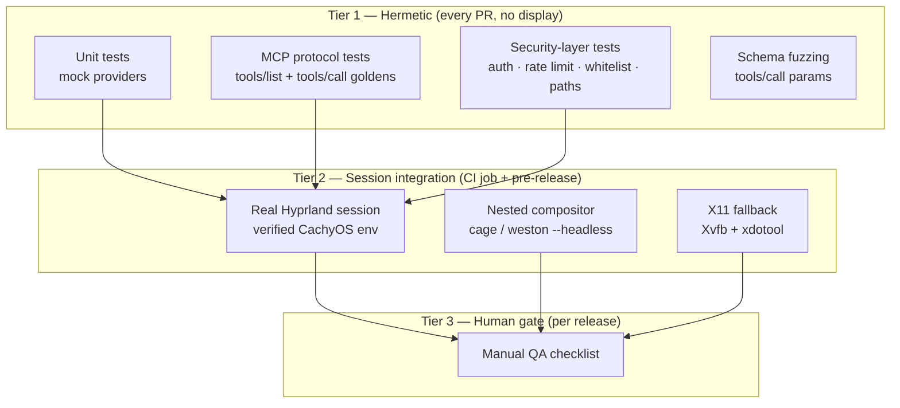

# Testing Strategy

> **Status:** Implemented — describes the test pyramid shipped with v1.2.0
> (Phases 0–5 complete, plus the v1.1.0 wave: X11 provider rungs, OCR cache,
> Sentry, additional metrics — and the v1.2.0 wave: clipboard, plugin macros,
> `screen_record`, sway IPC, per-backend features, history v2, AT-SPI scan
> cache).

ultranix-mcp automates a live GUI session, which makes naive end-to-end testing
host-dependent and flaky. The strategy therefore follows ultrawin's proven
pattern — **all OS coupling behind mockable provider traits** — and reserves real
compositor sessions for a thin, deterministic integration tier.

## Test Pyramid



## Tier 1 — Hermetic Tests

### 1.1 Unit tests via mock providers

Direct inheritance from ultrawin's `src/server.rs` test module: each provider
trait gets a mock, and the handler is constructed with
`Some(Arc::new(Mock*))` — no display server, no D-Bus, no GPU.

```rust
// Pattern (mirroring ultrawin server.rs tests):
pub struct MockCapture;
#[async_trait]
impl CaptureProvider for MockCapture {
    async fn capture_frame(&self) -> Result<DynamicImage> {
        Ok(DynamicImage::new_rgba8(8, 8)) // deterministic tiny frame
    }
}

pub struct MockInput;
#[async_trait]
impl InputProvider for MockInput {
    async fn mouse_click(&self, _x: i32, _y: i32, _b: &str) -> Result<()> { Ok(()) }
    async fn type_text(&self, _t: &str) -> Result<()> { Ok(()) }
    // ...record calls for assertion
}

fn handler_with(p: Providers) -> UltranixHandler { /* Option<Arc<dyn ..>> DI */ }
```

**Coverage rules:**

- **Every one of the 39 tools** has at least one happy-path unit test through
  `tools/call` with all-mock providers (the ultrawin `test_tools_exhaustive`
  pattern — one test iterating the full catalog).
- **Every tool** has a `None`-provider test asserting the structured
  capability-unavailable error (ADR 0004) — not a panic, not a transport error.
- **Every provider fallback chain** has a selection unit test: stub the probe
  results, assert the chosen implementation order (wlr → grim/slurp → portal →
  `None`; wlr-input → uinput → portal → `None`; hyprctl → `None` on Hyprland,
  `sway-ipc` → `None` on sway, `wmctrl` on non-Hyprland X11, `kdotool` →
  `None` on KDE (gated on the KDE session marker + pinned binary);
  scrot → portal on X11 capture;
  AT-SPI2 → `None`; CPU → OpenVINO → CUDA → ROCm → `None`; layer-shell →
  `None` for overlay; wl-clipboard → xclip/xsel → `None` for clipboard).
- **Negative-argument tests** per tool: missing required field, wrong type,
  out-of-range coordinates, oversized strings.

### 1.2 MCP protocol tests (golden)

The MCP surface is a public contract (ADR 0006); it is pinned by fixtures.

| Test | Mechanism | Assertion |
| ---- | --------- | --------- |
| `tools/list` full | drive `tools/list` via rmcp test client | byte-compares against `tests/golden/tools_list_all.json` — all 39 names, schemas, descriptions |
| `tools/list` filtered | start server with `--category=mouse,keyboard` | golden contains exactly the 9 expected tools; excluded categories absent |
| `tools/call` result shape | mock providers | every result conforms to `CallToolResult` (`content[]` with `type: text`/`image`) |
| `tools/call` unknown tool | `{"name": "nope"}` | typed `MethodNotFound`/`InvalidParams` error, matching golden |
| Initialize/shutdown | rmcp handshake fixture | capabilities negotiated per spec |
| HTTP transport | spawn server on :3010 test port | auth required (401 without `uxcp_*` key), `ULTRANIX_MCP_DISABLE_AUTH=true` bypass honored, `/health` `/readyz` `/metrics` respond |
| stdio transport | spawn binary, JSON-RPC over pipes | identical `tools/list` to HTTP golden |

Golden regeneration is explicit (`cargo test -- --ignored regenerate_goldens` or
an env-gated update mode), never automatic in CI — diffs in goldens are PR
review items because they represent public API changes.

### 1.3 Security-layer tests

| Layer | Tests |
| ----- | ----- |
| `uxcp_*` auth | valid key → 200; wrong/missing/malformed prefix → 401; constant-time path exercised; disable-env honored and audit-logged |
| Rate limiter | 10 req/s bucket: 11th request in-window → 429; refill timing; per-client isolation; `/metrics`+health exempt |
| Sanitization | shell metacharacters (`;`, `|`, `` ` ``, `$()`, null bytes) stripped/rejected; length caps enforced |
| Command whitelist | each of the 6 binaries allowed via pinned absolute paths: `grim`, `slurp`, `scrot`, `hyprctl`, `xdotool`, `wmctrl`; `sh`, `bash`, `curl`, `busctl`, `gdbus`, and path-prefixed variants (`/bin/hyprctl` must resolve to the pinned absolute path, not merely the same basename) rejected |
| Arg constraints | exec-capable subcommands denied: `hyprctl dispatch exec`/`exec-once` rejected even though `hyprctl` is whitelisted; `xdotool`/`wmctrl` accepted only when the session resolved to the X11 chain; arg-injected escapes (`--help; rm`) rejected |
| Path whitelist | `$XDG_RUNTIME_DIR`, `/tmp`, `~/.ultranix-mcp/**` accepted post-canonicalization; `$HOME` outside `~/.ultranix-mcp/` rejected; `..` traversal, symlink escapes, `/etc/passwd` rejected |
| TOCTOU capture-write | screenshot/capture file outputs canonicalize-then-compare and open with `O_NOFOLLOW`; a symlink (or swapped directory component) planted between validation and the write is rejected — no write follows the race |
| Consent gate | `system_command`, `clear_action_history`, `replay_action`, `window_control close`, `clipboard_set`, `clipboard_clear` without consent → `-32015 ConsentRequired` + challenge token; retry with `consent_token` succeeds; expired/forged token rejected; `--allow-destructive` bypass honored and audit-logged |
| Plugin store & dispatch (v1.2.0) | manifest validation (name regex, catalog-name collision, semver version, ≤64 typed params, 1–32 steps, `plugin_*` step rejection, undeclared `${param}` refs); fresh tempdir scan per call; `plugin_run` param binding (undeclared keys rejected, `$$` escape, typed substitution); per-step consent re-challenge and `-32017 PluginStepError` on step `isError` |
| `screen_record` bounds (v1.2.0) | `duration_ms`/`interval_ms` range validation; 600-frame and 512 MiB caps end the run `truncated: true`; `manifest.json` written for partial/failing runs; `rec-<ulid>` dir is `0700` under the captures root or `/tmp` fallback |
| History format v2 (v1.2.0) | `UNXHIST2` magic + framed append round-trip; O(1) append path; v1 whole-file read + migration rewrite on next append; FIFO-eviction rewrite |
| AT-SPI scan cache (v1.2.0) | 300 ms TTL reuse — two queries in-window issue one tree scan; expiry re-scans; `path:` queries bypass the cache |
| Consent-token binding | tokens are CSPRNG-generated, single-use, 60 s TTL, bound to `key_id`/session + tool + `args_hash`; a token issued under key A is **rejected when presented under key B** (cross-key binding); a token for tool X does not authorise tool Y or different args |
| Replay re-challenge | re-submitting a previously consented gated call (or a recorded `replay_action` step) triggers a **fresh** `-32015` challenge — a spent token never re-authorizes, and the new challenge carries a new `consent_token` |
| udev rule contents | packaged `packaging/99-ultranix-mcp-uinput.rules` asserted verbatim: `SUBSYSTEM=="uinput", MODE="0660", GROUP="ultranix-input", OPTIONS+="static_node=uinput"` — dedicated group, never `input`; `uaccess` variant documented as a complement |
| History crypto | AES-256-GCM round-trip; tampered ciphertext rejected; `history.json` not readable as plaintext |
| Audit | every call emits exactly one JSONL line with tool, `key_id`, `args_hash` (never raw args), outcome, duration; `prev_hash` chain verification detects a broken or reordered link |

### 1.4 Fuzzing — schema parsing

`tools/call` arguments are the widest attack surface (arbitrary JSON per tool).
`cargo-fuzz` target `fuzz/fuzz_targets/tool_args.rs` deserializes random JSON into
each tool's argument struct and asserts: no panic, no unbounded allocation,
error type stays `InvalidParams`. Seeded corpus includes the golden fixtures,
malformed UTF-8, deep nesting (>100 levels), huge strings (≥16MB), and
`find_icon` natural-language queries. CI runs a time-boxed 60s fuzz smoke per
PR; a nightly job runs 15min.

## Tier 2 — Session Integration Tests

Marked `#[ignore]` by default; run via `cargo test -- --ignored` in the
integration CI job or a release pipeline. Each test asserts **real** behavior on
a **real** session — no mocks.

### 2.1 Real Hyprland session (verified environment)

Environment: CachyOS + Hyprland/Wayland + PipeWire + xdg-desktop-portal-hyprland
+ AT-SPI2 live + Rust 1.98.1.

| Test | Assertion |
| ---- | --------- |
| `screenshot` (wlr-screencopy) | valid PNG, non-empty, matches output geometry; p95 latency <50ms over 20 captures |
| `mouse_click` / `mouse_move` | event lands on a test surface (verified via `hyprctl -j cursorpos` and a focused test window's event log); dispatch <10ms |
| `type_text` / `key_control` | text arrives in a target `foot`/`gtk4-demo` field |
| `get_windows`, `get_active_window`, `window_control` | consistent with `hyprctl -j clients` within 100ms |
| `get_ui_tree`, `get_focused_element`, `find_element` | live AT-SPI2 tree from a launched GTK test app; `find_element` bounds land inside the window's reported geometry |
| `find_text_on_screen` | OCR a window rendered with known text; ≥1 expected word found with correct bounds; second identical-frame call within 10s hits the OCR cache (<1ms) |
| `find_icon` | OWL-ViT locates a known icon in a test scene |
| `web_query` | Chromium with `--remote-debugging-port=9222`; CSS selector eval returns expected node |
| Degradation drill | restart without `HYPRLAND_INSTANCE_SIGNATURE` / AT-SPI2 bus stopped → `/readyz` reports `None`; tools return capability-unavailable |

### 2.2 Nested compositor (disposable sessions)

For CI where a full seat is unavailable:

- **cage** (or `weston --headless`) launches an isolated wlroots instance inside
  the CI job's session or a `seatd`-backed VT.
- Runs the Tier-2.1 subset that only needs wlroots protocols: screencopy,
  virtual-pointer/keyboard, UI tree of a nested test client.
- Enables **parallel, hermetic** GUI integration runs — no DISPLAY contention,
  torn down per job.

### 2.3 X11 fallback testing (X11 provider rungs shipped at v1.1.0)

- `Xvfb :99` + `fluxbox`-style minimal WM; provider chain must resolve
  `scrot`/`xdotool`/`wmctrl` implementations.
- Assertions: `screenshot` returns a valid frame via `scrot`, `mouse_click`
  dispatches via `xdotool`, `get_windows` lists via `wmctrl`.
- Also validates that wlroots/portal probes correctly *decline* in an X11
  environment (no false-positive backend selection).
- With `xclip`/`xsel` installed: `clipboard_set`→`clipboard_get`→
  `clipboard_clear` round-trip on X11 (consent-gated writes).

### 2.4 v1.2.0 paths — hermetic today, live sessions pending

The v1.2.0 providers are covered hermetically (Tier 1): clipboard tools
via mock `ClipboardProvider` + fake helper binaries, `SwayWindow` via a
fake i3-flavoured IPC responder, plugins via tempdir manifest stores,
`screen_record` via mock capture + tempdir output roots. **Live-session
evidence remains Hyprland/wlr-only** (Tier 2.1); sway, KDE, GNOME,
Wayfire/river, and clipboard-helper runs are implemented and unit-tested
but not yet smoke-tested on real sessions — add Tier-2 jobs as seats
become available (sway session on `$SWAYSOCK`; KDE/GNOME portal sessions;
a wl-clipboard-equipped Wayland seat).

## CI Matrix

| Job | Command | Gate |
| --- | ------- | ---- |
| fmt | `cargo fmt --check` | blocking |
| clippy | `cargo clippy --all-targets -- -D warnings` | blocking |
| build | `cargo build --release` (Linux x86_64; aarch64 best-effort) | blocking |
| unit + protocol | `cargo test` (Tier 1; no display required) | blocking |
| doc | `cargo doc --no-deps` + mermaid lint via `mmdc` | blocking |
| audit | `cargo audit` + `cargo deny check` | blocking |
| coverage | `cargo llvm-cov` → report | ≥90% lines on `src/`, enforced ratchet |
| fuzz smoke | `cargo fuzz run tool_args -- -max_total_time=60` | blocking (nightly: 15min) |
| integration — Hyprland | Tier 2.1 on a real-session runner (self-hosted CachyOS/Hyprland box) | release-blocking |
| integration — nested | `cage`/`weston --headless` job | blocking where seatd available |
| integration — X11 | `Xvfb` job | release-blocking once scheduled (X11 rungs shipped at v1.1.0) |

**Miri consideration:** `cargo miri test` runs on the pure-logic subset
(sanitization, whitelist matching, history codec, cache TTL logic) — providers
perform FFI/ioctls Miri cannot model, so the Miri job is scoped to a
`miri`-whitelisted module set, not `--workspace`. UB-detection value is real
(unsafe boundaries live at the Wayland/evdev edge); full-workspace Miri is
explicitly out of scope.

**Coverage target: ≥90% line coverage on `src/`.** Rationale: the provider-mock
pattern makes tool handlers fully reachable hermetically; FFI glue inside
backend implementations is covered by Tier 2 and excluded from the ratchet
denominator only where `#[cfg]`-gated to real sessions.

## Manual QA Checklist (per release)

Executed on the verified environment before tagging:

- [ ] Fresh `systemctl --user` install boots; `journalctl --user -u ultranix-mcp` shows the provider-resolution table
- [ ] `tools/list` over stdio and HTTP returns identical catalogs
- [ ] HTTP request without `uxcp_*` key → 401; with `ULTRANIX_MCP_DISABLE_AUTH=true` → served; audit records both
- [ ] 11 rapid calls → at least one 429; `/metrics` still responds
- [ ] `system_command` accepts `hyprctl -j activewindow`; rejects `sh -c`, `curl`, `busctl`, `../../etc` path arg, and `hyprctl dispatch exec`; first destructive call → `-32015 ConsentRequired`, retry with `consent_token` succeeds
- [ ] `screenshot` <50ms (wlr path); `mouse_click` dispatch <10ms; `get_ui_tree` <500ms; `find_text_on_screen` uncached <2s
- [ ] `history.json` encrypted at rest (not greppable); `replay_action` reproduces a recorded `mouse_click`
- [ ] `get_action_history` → `clear_action_history` → history empty; gauge `ultranix_mcp_action_history_size` = 0
- [ ] Kill AT-SPI2 bus → `/readyz` reports provider `None`; `get_ui_tree` returns structured capability error; restore → next boot resolves again
- [ ] Non-Hyprland Wayland session (GNOME/KDE): portal/uinput chain resolves; documented degraded tools behave per spec
- [ ] X11 session (or Xvfb): scrot/xdotool/wmctrl chain works end-to-end
- [ ] Model cache: `find_icon` downloads once to `~/.ultranix-mcp/models/`; second boot reuses; digest mismatch re-fetches
- [ ] Prometheus: all 10 shipped metrics present, correct types/labels; with `ULTRANIX_MCP_SENTRY_DSN` set, a forced error is captured by Sentry (a malformed DSN warns and disables)
- [ ] `--category=vision` serves exactly the 13 vision tools; `--category` omitted serves all 39
- [ ] Upgrade path: stop unit → replace binary → start; `history.json` and logs preserved under `~/.ultranix-mcp/`

## Phase-to-Test Mapping

| Phase | New test surface |
| ----- | ---------------- |
| 0 — scaffold + mocks | all Tier-1 harness, goldens, CI matrix skeleton |
| 1 — Hyprland I/O | Tier-2.1 capture/input/window tests; Tier-1 security-scaffolding tests (arg constraints, consent gate, audit hash chain); nested-compositor job |
| 2 — AT-SPI2 | UI-tree/focus/find integration; `None`-degradation drill |
| 3 — vision + CDP | OCR/icon goldens, `web_query` on :9222; OCR cache-TTL tests (shipped at v1.1.0) |
| 4 — enterprise | full security table, metrics/health assertions, crypto round-trip |
| 5 — portability | non-Hyprland Wayland run, packaging smoke test; Xvfb job covers the v1.1.0 X11 rungs |
